**Evaluating the Impact of Discovered Causal Structures on**
**Structure-Aware Shapley Methods: An Experimental Pipeline**

Juan David Rios Garcia

*Master's Thesis Research Manuscript -- Industrial Engineering*

# 1. Introduction

Model explainability has become a fundamental prerequisite for the deployment of machine learning systems, particularly across high-stakes socioeconomic domains such as credit scoring, healthcare access, and public resource allocation, where algorithmic decisions must be transparently justified to affected individuals and regulatory bodies (Baron, 2023).

While Shapley values derived from cooperative game theory have emerged as a gold standard for local feature attribution due to their unique axiomatic foundations, traditional implementations frequently rely on the simplifying assumption of feature independence. This assumption treats all feature permutations as equally probable during coalition formation, which can systematically misattribute credit when the true generative process involves structured causal dependencies among inputs (Lundberg & Lee, 2017; Heskes et al., 2020).

To mitigate these limitations, recent literature has introduced structure-aware Shapley frameworks that explicitly embed topological and causal constraints into the attribution process. Asymmetric Shapley Values (ASV) restrict permutations to those consistent with a causal ordering (Frye et al., 2021); Causal Shapley Values (CSV) replace observational marginalization with interventional conditioning based on Pearl's do-calculus (Heskes et al., 2020); and Shapley Flow reframes credit assignment from nodes to directed edges in a causal graph (Wang et al., 2021). Each of these methods promises attributions that are more faithful to the underlying causal mechanism that generated the data.

Historically, these structure-aware Shapley frameworks have been demonstrated almost exclusively on well-characterized systems, domains backed by years of research where the causal links between variables are firmly established and treated as ground truth. A different situation arises far more often in practice: a practitioner suspects that causal relationships exist among the features of a system but cannot point to a validated graph describing them. In this setting, a traditional Shapley computation will ignore those dependencies entirely, distributing credit as if every feature were an independent, interchangeable coalition partner. The practitioner is therefore caught between a method that disregards causal structure and a family of methods that assume it is already known.

A critical bottleneck in prior work is the assumption that the underlying Causal Directed Acyclic Graph (DAG) is known a priori or completely specified by a domain expert. In practical applications, the true causal graph is almost never directly observable. Practitioners must instead rely on automated causal discovery algorithms such as the constraint-based PC algorithm (Spirtes et al., 2000) and the functional causal model DirectLiNGAM (Shimizu et al., 2011) to infer a plausible graph structure from observational data. These estimated graphs are inherently noisy, subject to false-positive and false-negative edge errors, and sensitive to violations of their underlying assumptions (Glymour et al., 2019).

This thesis addresses this open gap by constructing a comprehensive experimental pipeline that integrates automated causal discovery directly into structure-aware explainability frameworks and systematically measures how graph estimation errors propagate downstream into feature attribution outputs. The pipeline evaluates three structure-aware Shapley methods (Asymmetric Shapley, Causal Shapley, and Shapley Flow) under three causal graph sources: the PC-discovered graph, the LiNGAM-discovered graph, and the True DAG used as an oracle reference. Evaluation is performed on two benchmarks: a controlled synthetic dataset with 50 features and known linear causal structure, and the real-world Sachs cell signaling dataset (Sachs et al., 2005), where an established consensus DAG allows external validation.

The central research question is: when a practitioner feeds an imperfect discovered causal graph into a structure-aware Shapley method, does the method produce attributions that meaningfully differ from a graph-free baseline, and do those attributions move closer to or further from the oracle attributions obtained with the True DAG? The answer has direct implications for how causal explainability tools should be adopted in practice.

To answer this question consistently, the analysis tracks two dimensions along which an attribution can shift when causal structure is injected: the magnitude of the attribution assigned to a feature and the direction (sign) of that attribution. This separation is deliberate. Prior comparisons of attribution methods overwhelmingly report how much the size of the attributions changes, while the question of whether a feature's contribution flips from pushing a prediction up to pushing it down is reported far less often, even though a sign reversal is arguably the more consequential failure for a practitioner trying to explain a single decision. A graph that merely rescales attributions still preserves the qualitative story told to an affected individual; a graph that inverts signs tells the opposite story. Both dimensions therefore matter, and they can move independently: a method may keep magnitudes stable while reordering signs, or preserve signs while inflating magnitudes. The two dimensions are operationalized by a single metric each, used identically across every comparison: a Magnitude Divergence and a Sign Disagreement, each reported relative to a named reference (the graph-free baseline, the oracle DAG, or the opposite discovered graph). The mathematical logic of both metrics are detailed deeply in Section 3.5. Thanks to this dual-axis approach operates independently of any specific dataset or model architecture, it establishes a universal, replicable framework for future work; for now, setting magnitude and direction as our primary analytical axes provides the definitive standard needed to assess the viability of any structure-aware method in real-world scenarios.

# 2. Conceptual Framework and Methodology

## 2.1 Model Explainability and Causal Understanding

A fundamental distinction must be established regarding the objective of model explainability. Rather than attempting to reveal the underlying laws of a real-world physical system, the focus of this work is strictly bounded to explaining the predictive behavior of a trained machine learning model. This distinction mirrors the conceptual separation established by Baron (2023) between causal understanding of nature and causal understanding of a model's decision function.

In practical machine learning scenarios, conducting physical manipulations or randomized controlled treatments is often expensive, time-consuming, or ethically impossible. Consequently, model explanations must be grounded in the observational data distribution used during training, while ideally respecting the causal relationships that govern how features jointly determine model outputs. Structure-aware Shapley methods operationalize this grounding by encoding causal relationships as constraints on the attribution computation, rather than by performing physical interventions.

## 2.2 Counterfactual Explanations and the Structural Causal Model Framework

Counterfactual explanations provide an intuitive contrastive explainability framework by identifying the minimal input feature perturbations required to alter an algorithmic output (Wachter et al., 2018). Standard optimization methods, however, generate counterfactuals that may violate physical plausibility constraints by placing instances in low-density regions of the joint feature space or proposing changes that contradict causal relationships (Mahajan et al., 2020).

To satisfy real-world feasibility constraints, explanations must be grounded within a Structural Causal Model (SCM), formally defined as a tuple G := (S, P(epsilon)), where S is a collection of deterministic structural equations of the form x_i = f_i(Pa(x_i), epsilon_i), and P(epsilon) is a joint distribution over independent exogenous noise variables (Pearl, 2009). Full abduction-action-prediction within an SCM is computationally demanding and requires complete structural equation knowledge. Structure-aware Shapley methods circumvent this bottleneck by using the causal graph topology to define conditional distributions for feature imputation, approximating the post-interventional distribution without requiring full structural equation reconstruction.

It is worth noting that the original Shapley Flow formulation (Wang et al., 2021) relies heavily on approximating these structural equations to actively propagate values along graph edges. However, for reproducibility purposes and to avoid strict dependence on a well-calibrated SCM, the implementation adopted in this thesis deliberately replaces full structural-equation evaluation with a lighter binary activation rule (detailed in Section 3.4.4). This approach preserves the framework's core conceptual contribution, attributing credit to directed edges rather than isolated nodes, while ensuring tractable computation that relies solely on the discovered graph topology and trained predictive model.

## 2.3 Causal Discovery: Structure Identification

Estimating the causal graph is a critical step in the experimental pipeline, we utilize two prominent causal discovery algorithms that are readily accessible to any practitioner.

PC Algorithm (Spirtes et al., 2000): A constraint-based method that recovers the causal skeleton through conditional independence tests (Fisher-z at alpha = 0.05) and applies Meek's orientation rules to produce a Completed Partially Directed Acyclic Graph. Undirected edges are resolved by orienting them from lower to higher feature index, yielding a valid DAG for downstream Shapley computation.

DirectLiNGAM (Shimizu et al., 2011): A functional causal model that exploits linear non-Gaussian structures to simultaneously identify causal ordering and structural coefficients. Each entry in the estimated adjacency matrix represents the linear weight a parent contributes to a child. Because DirectLiNGAM initially returns a dense matrix containing minor estimation noise, a magnitude threshold is applied to recover a sparse structure. Edges with an absolute coefficient below 0.10 are pruned; this cutoff effectively treats weak direct effects as noise, maintaining a graph density comparable to the other configurations without discarding meaningful dependencies.

Both algorithms operate strictly on the X-only training partition, excluding the target for the dicovery step. While both the synthetic dataset and the real-world biological data likely do not perfectly fulfill all the theoretical requirements of these algorithms, this imperfection is deliberate. It serves as a realistic robustness test, reflecting the natural unmeasured confounding and structural uncertainty practitioners face in deployment.

## 2.4 Traditional Shapley Values and the Axiomatic Framework

Traditional Shapley values originate in cooperative game theory as the unique solution to the problem of fairly dividing the total payoff of a game among the players who produced it (Shapley, 1953). In the explainability transfer of this idea, the players are the input features, the coalition is any subset S of features whose values are known, and the payoff of a coalition is the model output produced when only those features take their actual instance values while the remaining features are treated as absent. A feature that is in the coalition contributes its real value x_j; a feature that is out of the coalition is marginalized over the background distribution, so the model is evaluated as if that feature's value were unknown and drawn from the data at large. The marginal contribution of a feature is then the change in the payoff caused by moving that feature from outside the coalition to inside it, that is, the difference f(S union {i}) - f(S) between the model output with the feature added and the model output without it.

Because this marginal contribution depends on which features are already present, the Shapley value averages it over every order in which the features could be added to the coalition. Concretely, for a given permutation of the features each feature is added one at a time, its marginal contribution against the coalition of all features preceding it in that order is recorded, and the Shapley value of a feature is the average of these marginal contributions taken over all N! permutations. Averaging over all orderings is precisely what makes the allocation fair in the game-theoretic sense and is what guarantees the four axioms below. The construction satisfies Efficiency (the attributions sum to the gap between the prediction for the instance and the average prediction, f(x) minus the baseline), Linearity (attributions from model ensembles combine linearly), Null Player (zero attribution for features with no marginal contribution in any coalition), and Symmetry (two features that contribute identically to every coalition receive equal credit). The Symmetry axiom is too restrictive for causal systems: it treats all features as interchangeable coalition partners, weighting every ordering equally, which misattributes credit from downstream effects to upstream causes when the two are correlated through the causal structure.

## 2.5 Structure-Aware Shapley Methods: Theoretical Foundations

Structure-aware Shapley frameworks preserve Efficiency, Linearity, and Nullity while modifying or relaxing Symmetry to accommodate causal topologies.

### 2.5.1 Asymmetric Shapley Values (ASV)

ASV breaks the Symmetry axiom by replacing the uniform distribution over feature orderings with a weighting scheme w(pi) that places probability mass exclusively on permutations consistent with a partial causal ordering (Frye et al., 2021). Concretely, the causal DAG is used to derive a topological order over the features, and only those permutations that respect this order, in which every ancestor appears before each of its descendants, are admitted into the averaging. This restriction shrinks the permutation universe relative to Traditional Shapley: instead of averaging over all N! orderings, ASV averages only over the valid linear extensions of the partial order encoded by the graph, a strict subset whose size shrinks as the graph becomes more connected. Ancestral causes therefore always precede their downstream effects during coalition formation, preventing descendant features from receiving credit for contributions mediated by their ancestors.

Apart from this restriction on the ordering, ASV is mechanically identical to Traditional Shapley. The notion of a coalition is unchanged, features inside the coalition take their instance values and features outside it are marginalized over the background distribution, and the marginal contribution is still the same difference f(S union {i}) - f(S) evaluated through the model. ASV retains observational marginalization for absent features, constraining only the permutation space and not the imputation distribution; the DAG enters the computation solely through the set of admissible orderings.

Formally, the attribution is the expectation of a feature's marginal contribution taken over orderings drawn uniformly from the topological orderings of the feature DAG:

phi_i(ASV) = E_{pi ~ U(Pi_topo)} [ v(P_i^pi union {i}) - v(P_i^pi) ],

where Pi_topo is the set of all topological orderings (linear extensions) of the feature DAG, U is the uniform distribution over that set, P_i^pi is the set of features preceding i in the ordering pi, and the value function v(.) is exactly the observational coalition value of Traditional Shapley, v(S) = E[f(X) | X_S = x_S], estimated by marginalizing the absent features over the background data. The only change relative to Traditional Shapley is the replacement of the universe of all N! orderings by the subset Pi_topo consistent with the DAG; because every feature still appears in every admissible ordering, no feature is forced to a structural-zero attribution. In our implementation a uniform linear extension is drawn by a randomized Kahn procedure that maintains a pool of "ready" nodes whose ancestors have all been placed and selects one uniformly at each step, which respects every ancestor-descendant pair simultaneously and costs O(N) per ordering.

### 2.5.2 Causal Shapley Values (CSV)

CSV retains a symmetric formulation over permutations but redefines the value function using interventional distributions rather than observational conditioning (Heskes et al., 2020). The coalition and averaging machinery is the same as in Traditional Shapley; what changes is how the absent features are filled in. Where Traditional Shapley conditions on the coalition features, preserving the correlations a confounder induces, Causal Shapley intervenes on them with Pearl's do-operator:

Traditional: v(S) = E[f(X) | X_S = x_S]    versus    Causal: v_do(S) = E[f(X) | do(X_S = x_S)].

Intervening cuts the incoming edges of the features in $S$, so a feature is credited only for effects that flow through its own outgoing causal paths and not for indirect effects inherited from upstream correlations. The node-level attribution keeps the standard Shapley weighting:

phi_i(CSV) = Sum_{S subset of N\{i}} [ |S|!(|N|-|S|-1)! / |N|! ] * [ v_do(S union {i}) - v_do(S) ].

To make the interventional value computable, the theoretical formulation of CSV supports explicitly modeling shared hidden causes by merging bidirected confounder pairs into joint components. However, to ensure computational reproducibility across all experiments, explicit confounder information is not supplied for either the synthetic or the Sachs dataset in this implementation. Instead, every feature is treated as an independent component. This approach streamlines the architecture while strictly preserving the core do-intervention sampling across the network.

The computation relies on two distinct levels of stochasticity. An outer loop draws, for each Shapley trial, a fresh uniform random linear extension of the full feature DAG. An inner loop then estimates $v_{do}(S)$ from $M$ Monte Carlo draws of the post-interventional distribution $P(X \mid do(X_S = x_S))$. The inner loop always traverses the features in a fixed deterministic topological order, because propagating an intervention correctly requires each node's parents to be resolved before the node itself.

Each post-interventional draw fixes the intervened features to their instance values and then, proceeding in the fixed topological order, fills in the remaining features from their respective parents. Because confounder components are disabled, the missing features are drawn sequentially using the closed-form univariate Gaussian expression under a multivariate-Gaussian approximation of the background data X ~ N(mu, Sigma):

mu_{A|B} = mu_A + Sigma_AB Sigma_BB^{-1} (x_B - mu_B),    Sigma_{A|B} = Sigma_AA - Sigma_AB Sigma_BB^{-1} Sigma_BA.

By executing this continuous interventional sampling natively across the DAG, the method effectively severs non-causal information flow without requiring the immense computational overhead of multivariate confounded-component tracking

### 2.5.3 Shapley Flow

Shapley Flow moves from node-based to edge-based attribution (Wang et al., 2021). It extends the classical Shapley axioms to directed graph edges and introduces a Boundary axiom: the sum of attribution flow entering any intermediate node equals the sum leaving it, ensuring credit conservation at intermediate nodes. The system is viewed as a connected graph running from source features through intermediate features to the target Y, and the game asks how much each edge contributes to moving the prediction from its background value to its foreground value. The players are therefore the edges, not the features, and each edge receives the average marginal contribution it makes as edges are activated in random order:

phi_{u->v} = E_{pi ~ U(Pi_E)} [ V(E_{u->v}^pi union {u->v}) - V(E_{u->v}^pi) ],    phi_u = Sum_{v: u->v in E} phi_{u->v},

where Pi_E is the set of orderings of the edge set E, E_{u->v}^pi is the set of edges preceding u->v in the ordering pi, V(.) is the system value of a set of active edges, and node-level importance is recovered by summing each node's outgoing edge credits. The system value assigns every node either its foreground value, taken from the instance, or its background value: a node takes its foreground value if it is a source with at least one active outgoing edge, or if it has at least one active incoming edge, or if its direct edge to Y is active; otherwise it takes its background value, and Y itself is always stripped before the model is evaluated. With this rule the empty edge set yields the background prediction and the full edge set yields the foreground prediction, so the edge credits satisfy efficiency exactly: the sum of all edge credits equals f(x_fg) - f(x_bg). Because credit is routed along edges, graph errors propagate along all paths connected to an affected edge, not only at the node level.

The DAG plays a more central role here than in either ASV or CSV, because its edges are the players: with no graph there is no game to play. In the faithful formulation of Wang et al. (2021) the graph additionally supplies the structural mechanism between connected nodes, propagating each parent's value through the corresponding causal function f_parent-to-child(x_parent) when a node lies outside the active edge set; this couples a node's attribution to its entire upstream sub-graph and is the source of the method's computational cost. The implementation in this thesis preserves the edge-as-player formulation and the efficiency property but, as discussed in Section 2.2, replaces the full structural-equation propagation with the lighter binary foreground/background activation rule above, so that the method depends only on the discovered graph and the trained model. A final implementation detail involves how edges are ordered during the sampling process. Instead of forcing edges to activate in a strict causal sequence (from upstream roots to downstream leaves), they are shuffled entirely at random. Randomly shuffling the edges ensures that, roughly half the time, an intermediate feature's effect on the target is evaluated before its parents update it. This allows the framework to fairly capture the full direct impact of intermediate features, preventing root causes from absorbing all the credit.

# 3. Experimental Setup and Practical Implementation

The proposed experimental pipeline to help practitioners navigate scenarios where measured systems contain underlying causal connections or highly correlated features, the proposed experimental pipeline is outlined below. Within this framework, two distinct datasets are evaluated across multiple structure-aware Shapley methods. The resulting variations in feature attributions are measured along two primary dimensions: magnitude deviation and sign disagreement, both of which are critical for ensuring the reliability of local explanations.

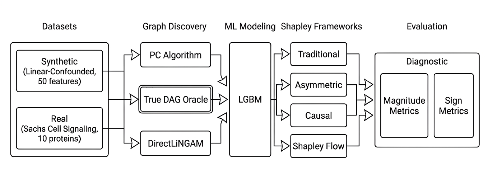

***Figure 3.0: Overview of the experimental pipeline.*** End-to-end flow from data generation and causal discovery through Shapley computation to evaluation, illustrating how the two datasets, three graph sources, and three structure-aware methods feed into the magnitude and sign metrics.

## 3.1 Data Synthesis and Target Datasets

The experimental pipeline employs a synthetic benchmarking framework to generate a dataset with a known, deterministic ground-truth causal structure. Specifically, the analysis in this thesis relies on a simulated linear system with confounding, paired alongside the real-world Sachs dataset. This linear configuration was selected because it closely matches the operating assumptions of the two discovery algorithms: both the PC algorithm and DirectLiNGAM are designed around linear structural relationships. By utilizing a linear data-generating process, the discovery task remains aligned with what these estimators can in principle recover, ensuring that the errors observed downstream can be attributed to confounding and finite-sample noise rather than a fundamental mismatch between the data and the estimators' functional assumptions. The deliberate addition of hidden confounders then violates the causal sufficiency assumption shared by both algorithms, providing precisely the stress condition of interest. The two core cases analyzed throughout the pipeline are therefore the following:

Linear System with Confounding (Synthetic): Strictly linear structural equations X_j = Sum_{i in Pa(j)} w_ij * X_i + epsilon_j, with epsilon_j ~ N(0, 0.5) and coefficients drawn from Uniform(0.5, 2.0) with random sign. The graph is Erdos-Renyi with edge probability p = 0.07, yielding 87 $X \to X$ edges across 50 features (~1.74 edges per node). Exactly 15 of 50 features are direct causal parents of Y (y_parents_ratio = 0.30). Five hidden confounders each additively influence 2-3 features, violating causal sufficiency for both discovery algorithms. Dataset parameters: N_FEATURES = 50, N_SAMPLES = 1000, random_state = 42.

Sachs Cell Signaling Dataset (Real Data): 7,466 simultaneous measurements of 11 protein concentrations in stimulated human T-cells (Sachs et al., 2005), obtained from the Carnegie Mellon University Philosophy Department causal datasets repository (Scheines, 2024). Akt kinase (akt) is the regression target Y and 10 proteins are input features (raf, mek, plc, pip2, pip3, erk, pka, pkc, p38, jnk). A consensus reference DAG has 17 $X \to X$ edges and 3 direct $X \to Y$ edges (pip3->akt, pka->akt, erk->akt). Raw concentrations are preprocessed in two steps, first log1p transformation is applied to the entire dataset before the train/test split and secondly after splitting, a Standard Scaler is fit exclusively on the training partition and then applied to both train and test sets, bringing all proteins to μ=0, σ=1; this ensures LiNGAM's |coef|<0.10 pruning threshold is scale-consistent across all proteins regardless of raw concentration range, and prevents any information from the test set from leaking into the scaling statistics.

Both datasets use an 80/20 train/test split with random seed 42. The synthetic graph density (~7.1%, 1.74 edges/node) was calibrated to match the Sachs network density, enabling direct comparison between the two experimental tracks.

## 3.2 Predictive Model

A LightGBM gradient-boosted tree regressor is fitted to each dataset using Optuna-based hyperparameter optimization (50 TPE trials, RMSE objective). Feature selection is disabled for both datasets so that all input features participate in the model, keeping the feature space consistent with the causal graph and Shapley computation.

***Table 3.1: Predictive Model Performance and Output Distribution on Test Sets. The output std $\hat\sigma$ is the standard deviation of the LightGBM predictions and is the scale used to normalise the magnitude metrics in Section 3.5.***

| **Dataset** | **R2** | **RMSE** | **MAE** | **Output mean** | **Output std $\hat\sigma$** |
| --- | --- | --- | --- | --- | --- |
| Linear-Conf (synthetic) | 0.900 | 1.72 | 1.36 | ≈ -0.47 | 4.71 |
| Sachs (real data) | 0.679 | 88.78 | 17.82 | ≈ 81.2 (Akt units) | 116.76 (Akt units) |

Beyond accuracy, $\hat\sigma$ is recorded as a first-class model summary because all magnitude metrics in Section 3.5 are reported as a fraction of it. The two datasets live on incomparable raw scales ($\hat\sigma = 4.71$ for the synthetic target vs. $\hat\sigma = 116.76$ Akt units for Sachs); dividing by $\hat\sigma$ makes a Magnitude Divergence of 0.10 mean the same thing on both tracks a shift of 10% of the model's explainable output spread. The formal justification for this choice of normaliser is given in Section 3.5.3.

## 3.3 Causal Discovery Framework

### 3.3.1 DirectLiNGAM Integration

The pipeline uses causal-learn's DirectLiNGAM. The library outputs an adjacency matrix where matrix[i,j] is the coefficient of X_j on X_i; the matrix is transposed before binarization. Edges with |coefficient| < 0.10 are pruned to remove near-zero connections.

### 3.3.2 PC Algorithm Integration

Constraint-based discovery uses causal-learn's pc function with the Fisher-z test at alpha = 0.05. Undirected edges in the resulting CPDAG are resolved by orienting them from the lower to the higher feature index. Cyclic edges introduced by this step are detected and removed.

### 3.3.3 $X \to Y$ Edge Augmentation Rule

Both PC and LiNGAM operate on the X-only feature matrix and therefore produce no edges to Y. Because Shapley Flow requires at least one direct $X_i \to Y$ edge per feature to accumulate edge credit, an explicit augmentation step appends $X_i \to Y$ edges for every feature in the prediction model. In practice this connects all features to Y, since feature selection is disabled. The same rule is applied uniformly across all methods and to the True DAG reference graph.

### 3.3.4 Discovery Performance

Figure 3.1 summarizes causal discovery quality (F1 on the $X \to X$ edges) and predictive model fit (test-set R2) for both datasets.

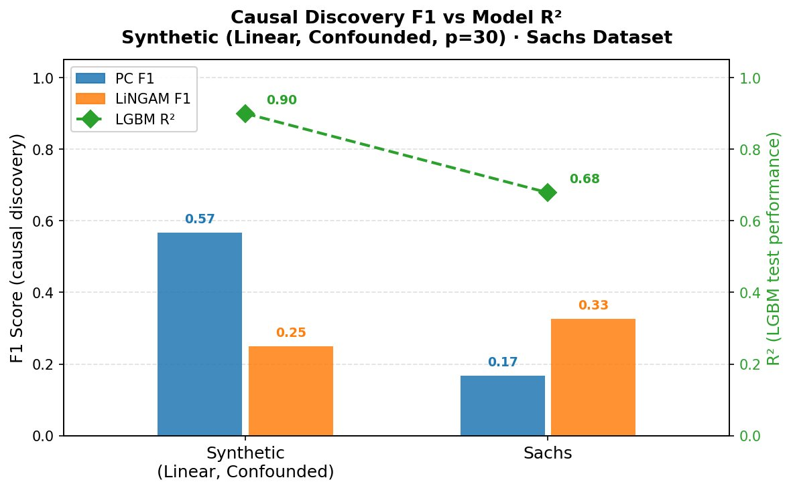

***Figure 3.1: Causal discovery F1 ($X \to X$ edges) versus LightGBM test R2, synthetic vs. Sachs.*** Bars give PC and LiNGAM F1 on each dataset; the dashed line tracks model R2. The discovery-quality ordering of the two algorithms reverses between tracks even as model fit declines from synthetic to real data.

On the synthetic track, PC outperforms LiNGAM (F1: 0.567 vs. 0.250): conditional independence tests partially block confounder-induced associations, while LiNGAM's functional causal model conflates them with direct paths, flooding the graph with 81 false positives. On Sachs the ordering flips (F1: 0.326 vs. 0.167), log-transformed protein concentrations retain non-Gaussian residuals that LiNGAM can exploit, a property that PC's Fisher-z test cannot leverage. Notably, both algorithms perform substantially worse on the real data despite the larger sample size, and PC's output required removing two cycles before it was a valid DAG, a sign that real biological signal is harder to recover than synthetic confounded structure.

## 3.4 Shapley Computation Settings

Computing exact Shapley values requires evaluating every possible coalition of features, and for a 50-feature system this amounts to 2^50 coalitions. The cost is severe even for the graph-free baseline, but it is compounded for the structure-aware methods: because they follow the DAG during the value computation, sampling interventional values along a topological order or activating edges in sequence, each coalition evaluation is itself more expensive than a single model call, so an exhaustive enumeration becomes outright unfeasible in practice. For this reason every Shapley method in this pipeline, the graph-free baseline included, is computed with the same Monte Carlo permutation approximation rather than by exact enumeration, using T = 100 sampled permutations. For each dataset, 30% of training rows serve as the background reference distribution (240 rows for synthetic; 1,791 for Sachs), and up to 100 test instances are explained. All random operations use seed 42.

Ten combinations of structure-aware Shapley method and causal graph are computed for the synthetic dataset: Traditional Shapley (baseline) plus the three structure-aware methods applied to three graph sources (PC, LiNGAM, True DAG). The Sachs dataset mirrors this design: Traditional Shapley plus the three methods applied to PC, LiNGAM, and the consensus reference DAG, which here serves the same oracle role that the True DAG plays on the synthetic track. The consensus Sachs graph is thus used both for evaluating discovery quality (Figure 3.1) and as the oracle Shapley input against which the discovered-graph attributions are compared. The same T = 100 permutation budget is applied to every combination on both tracks.

Table 3.2 summarizes what each method changes relative to Traditional Shapley. It is designed to be read one row at a time: each structure-aware method modifies exactly one ingredient of the Traditional recipe. Asymmetric Shapley changes only the permutation space; Causal Shapley changes only the value function, with the ordering following from the components; and Shapley Flow changes who the players are.

***Table 3.2: What Each Method Changes Relative to Traditional Shapley***

| **Property** | **Traditional Shapley** | **Asymmetric Shapley** | **Causal Shapley** | **Shapley Flow** |
| --- | --- | --- | --- | --- |
| Players | Features | Features | Features | Edges |
| Permutation space | All N! orderings | Topological orderings of the feature DAG | Topological orderings of the component DAG | All orderings of the edge set |
| Value function | Observational E[f \| X_S = x_S] | Observational (same as Traditional) | Interventional E[f \| do(X_S = x_S)] | Foreground/background by edge activation |
| Graph's role | None | Constrains the ordering | Defines components, ordering, and intervention propagation | Supplies the players (edges) |

### 3.4.1 Traditional Shapley Values (Graph-Free Baseline)

The baseline discards all causal information. All features are treated symmetrically: T = 100 uniformly random permutations of all features are sampled and, building each coalition incrementally, the marginal contribution of each feature is computed by replacing the absent features with values drawn from the background data. This is the standard SHAP Monte Carlo estimator (Lundberg & Lee, 2017) and serves as the graph-free reference against which all structure-aware methods are benchmarked.

The coalition value v(S) = E[f(X) | X_S = x_S] is estimated by the COALITION_VALUE subroutine (Appendix A.1), which overwrites the coalition columns of the background matrix with the instance's real values and averages the model output, and which is reused unchanged by Asymmetric Shapley.

```
ALGORITHM  Traditional Shapley (Monte Carlo)
INPUT : instance x, model f, background data D, number of permutations T
OUTPUT: attribution vector phi in R^n

phi      <- zeros(n)
baseline <- mean( f(D) )                  # v(empty): all features marginalised
FOR t = 1 ... T:
    pi     <- random_permutation(1 ... n) # unconstrained uniform ordering
    S      <- empty,  v_prev <- baseline
    FOR i in pi:                          # add features one at a time
        S      <- S union {i}
        v_curr <- COALITION_VALUE(x, S, f, D)
        phi[i] <- phi[i] + (v_curr - v_prev)
        v_prev <- v_curr
RETURN phi / T
```

The graph is never consulted, which is the defining property of the method. The cost is O(T * n * |D|) model rows evaluated per instance.

### 3.4.2 Asymmetric Shapley Values

The Asymmetric Shapley implementation retains the same observational coalition value as Traditional Shapley but replaces the uniform random permutation with a randomized Kahn topological sort that draws uniformly from the linear extensions of the feature DAG (the SAMPLE_TOPOLOGICAL_ORDERING subroutine, Appendix A.2). The modification is exclusively in the permutation space; the coalition values are computed identically through COALITION_VALUE. The children lists and initial in-degrees are precomputed once over the X-only subgraph, since Y is never a player; if the feature DAG contains a cycle the constraints are disabled and the method reduces to Traditional Shapley.

```
ALGORITHM  Asymmetric Shapley
INPUT : instance x, model f, background data D, feature DAG G, permutations T
OUTPUT: attribution vector phi in R^n

PRECOMPUTE children[], in_degree[] from the X-only edges of G  (Appendix A.2)
phi      <- zeros(n),  baseline <- mean( f(D) )
FOR t = 1 ... T:
    pi     <- SAMPLE_TOPOLOGICAL_ORDERING()   # ancestors precede descendants
    S      <- empty,  v_prev <- baseline
    FOR i in pi:
        S      <- S union {i}
        v_curr <- COALITION_VALUE(x, S, f, D) # SAME value fn as Traditional
        phi[i] <- phi[i] + (v_curr - v_prev)
        v_prev <- v_curr
RETURN phi / T
```

The cost is the same order as Traditional Shapley; the topological sampler adds only O(n) per permutation. The graph is consulted solely to build the ordering structures at initialization, and the value function never sees it.

### 3.4.3 Causal Shapley Values

Causal Shapley replaces the observational coalition value with post-interventional sampling that approximates Pearl's do-operator, v_do(S) = E[f(X) | do(X_S = x_S)]. The method has two nested levels of stochasticity that must be kept distinct: an outer loop that draws a fresh uniform linear extension of the component DAG for each Shapley trial, and an inner loop that, for each coalition, estimates the interventional value from M draws of the post-interventional distribution while traversing components in a fixed deterministic topological order so that each node's parents are resolved before the node itself. Each draw fixes the intervened features and fills in the remaining features from their parents using the closed-form conditional Gaussian of the background data; inside a confounded component the missing features are drawn independently given their parents (which destroys the spurious within-component correlation), while in an ordinary component they are drawn jointly given the parents and any fixed siblings. In this pipeline the confounder list is empty, so every feature is its own component, the outer ordering reduces to a uniform linear extension of the full feature DAG, and the inner sampler always takes the univariate-Gaussian branch. The experiments use T = 100 outer permutations and M = 10 inner samples.

```
ALGORITHM  Causal Shapley (post-interventional)
INPUT : instance x, model f, background data D, feature adjacency A (X only),
        confounder list, outer permutations T, inner samples M
OUTPUT: attribution vector phi in R^n

INIT: components, confounded[], parents[] <- BUILD_COMPONENTS(A, confounder list)
      mu <- mean(D);  Sigma <- cov(D) + epsilon*I        # epsilon for stability
phi      <- zeros(n),  baseline <- mean( f(D) )
FOR t = 1 ... T:                                         # OUTER: re-randomised
    pi     <- SAMPLE_COMPONENT_TOPOLOGICAL_ORDERING(), then expand to features
    S      <- empty,  v_prev <- baseline
    FOR i in pi:
        S      <- S union {i}
        v_curr <- 0                                      # INNER: estimate v_do
        FOR m = 1 ... M:
            v_curr <- v_curr + f( POST_INTERVENTIONAL_SAMPLE(x, S, ...) )
        v_curr <- v_curr / M
        phi[i] <- phi[i] + (v_curr - v_prev)
        v_prev <- v_curr
RETURN phi / T
```

The POST_INTERVENTIONAL_SAMPLE subroutine that draws a single sample from P(X | do(X_S = x_S)), together with the closed-form conditional-Gaussian draw it relies on, is given in Appendix A.3.

The cost is O(T * n * M) model evaluations, markedly heavier than Traditional or Asymmetric Shapley because of the inner sampling loop. The graph is used in three places: the directed edges define the parent sets for the interventional draws, the edges plus the confounder list define the component partition and the component DAG that constrains the outer ordering, and the same DAG fixes the deterministic inner traversal order.

### 3.4.4 Shapley Flow

Shapley Flow treats directed edges as the players of the cooperative game, permuting the full edge set rather than the feature set. In each of T = 100 trials all edges ($X \to X$ and $X \to Y$) are randomly permuted and activated sequentially, and the system value is evaluated after each activation. The node-value assignment is binary: a node takes its foreground value if it is a source with an active outgoing edge, or if it has an active incoming edge, or if its direct edge to Y is active; otherwise it takes its background value, and Y is always dropped before the model is evaluated. No intermediate model calls are made between X features; the model is evaluated only on the complete node-value vector at each edge addition. Node-level attributions are recovered by summing each node's outgoing edge credits, and by construction the credits satisfy efficiency, summing to f(x_fg) - f(x_bg). The $X \to Y$ augmentation of Section 3.3.3 is essential here, as it guarantees every feature has a direct route to accumulate edge credit.

```
ALGORITHM  Shapley Flow (uniform edge-permutation)
INPUT : foreground instance x_fg, background row x_bg,
        graph adjacency (n+1 nodes incl. Y), target index Y, trials T
OUTPUT: node attribution vector phi in R^n  (Y excluded)

E           <- list of all directed edges (u -> v) in the graph
edge_credit <- { e : 0.0  for e in E }
FOR t = 1 ... T:
    perm   <- random_permutation(E)          # unconstrained over ALL edges
    v_prev <- SYSTEM_VALUE(empty, x_fg, x_bg)    # = f(x_bg)
    active <- [ ]
    FOR e in perm:
        active.append(e)
        v_curr         <- SYSTEM_VALUE(active, x_fg, x_bg)
        edge_credit[e] <- edge_credit[e] + (v_curr - v_prev)
        v_prev         <- v_curr
FOR e in E: edge_credit[e] <- edge_credit[e] / T
phi <- zeros(n)                              # aggregate edges -> features
FOR each edge (u -> v) in E:
    IF u != Y: phi[u] <- phi[u] + edge_credit[(u -> v)]
RETURN phi
```

The SYSTEM_VALUE subroutine that maps a set of active edges to a model prediction, by assigning each node its foreground or background value under the activation rule, is given in Appendix A.4.

The cost is T * (|E| + 1) model evaluations per instance (for the synthetic system, roughly 50 x 276 ~ 1.4 x 10^4). This is the most structure-dependent of the four methods: the graph supplies the players themselves, so with no graph there is no game to play.

## 3.5 Evaluation Metrics

### 3.5.1 Notation

The following notation is used throughout the evaluation framework. Let $N$ be the number of input features, $\mathcal{F} = \{1,\ldots,N\}$ the feature index set, and $\mathcal{I}$ the set of test instances. The trained predictive model is $f: \mathbb{R}^N \to \mathbb{R}$, and $\hat\sigma = \mathrm{std}_{i \in \mathcal{I}}\, f(x_i)$ is the standard deviation of its predictions over the test set, the natural scale of the attribution space, so every magnitude number in this chapter is reported as a fraction of it. Let $m \in \{\text{Traditional, Asymmetric, Causal, Flow}\}$ index the Shapley method and $G \in \{\emptyset, \text{PC}, \text{LiNGAM}, \text{True DAG}\}$ the causal graph source.

The per-instance per-feature attribution $\phi^{m,G}_{i,f}$ is the Shapley value assigned to feature $f \in \mathcal{F}$ for instance $i \in \mathcal{I}$ by method $m$ using graph $G$. Every comparison fixes a subject $(m, G)$ with $G \in \{\text{PC}, \text{LiNGAM}\}$ and contrasts it against one of three reference configurations: the **baseline** ref (Traditional Shapley, $G = \emptyset$), the **oracle** ref (True DAG on synthetic, consensus DAG on Sachs), and the **cross-discovery** ref (same method on the opposite discovered graph, $\text{PC} \leftrightarrow \text{LiNGAM}$).

### 3.5.2 Two Dimensions, Two Metrics, Three Comparisons

Every comparison in this chapter asks the same two questions of a (method, graph) result against a reference: did the attribution change in **magnitude**, and did it change in **direction**? These are the two evaluation dimensions, and each is measured by a single metric used identically in all three comparisons:

* **Magnitude Divergence (ΔM)** — how much the absolute attribution moves relative to the reference, expressed as a fraction of the model-output standard deviation $\hat\sigma$. ΔM >= 0; ΔM = 0.10 means the typical attribution shifted by 10% of $\hat\sigma$.
* **Sign Disagreement (D)** — the fraction of (instance, feature) attributions that point in the opposite direction to the reference. D in [0, 1]; D = 0 means perfect directional agreement.

The only thing that changes between comparisons is the reference, which we carry as a Tag so the same two names cover all six cells of Table 3.3:

* Tag **base** — reference is Traditional Shapley (how far a graph moves attributions away from the graph-free baseline); Section 4.2.
* Tag **oracle** — reference is the True / consensus DAG (how faithfully a discovered graph recovers the oracle attributions); Section 4.3.
* Tag **disc** — reference is the opposite discovered graph (how much the choice of discovery algorithm alone perturbs attributions); Section 4.4.

***Table 3.3: Evaluation Metric Framework. Two metrics, two dimensions, three reference comparisons.***

| **Dimension** | **vs. Traditional (base)** | **vs. Oracle DAG (oracle)** | **PC vs. LiNGAM (disc)** |
| --- | --- | --- | --- |
| Magnitude | $\Delta M_{\text{base}}$ | $\Delta M_{\text{oracle}}$ | $\Delta M_{\text{disc}}$ |
| Sign / Direction | $D_{\text{base}}$ | $D_{\text{oracle}}$ | $D_{\text{disc}}$ |

### 3.5.3 Three Measurement Levels

Both metrics are defined once at the atomic instance level and then lifted to the feature and global levels by fixed aggregation operators, so a single definition serves all three reporting granularities. The level is stated wherever a value is reported; as a convention, tables give the global level, heatmaps the feature level, and scatter plots the instance level.

**Instance level (signed).** The atomic magnitude quantity is the signed gap between absolute attributions for one (instance, feature):

$$\delta^{\text{ref}}_{i,f} = \left|\phi^{m,G}_{i,f}\right| - \left|\phi^{\text{ref}}_{i,f}\right|.$$

This keeps its sign on purpose: a positive value means the discovered graph inflates the feature's local importance relative to the reference, a negative value means it suppresses it. The atomic sign quantity is the disagreement indicator $\mathbf{1}\!\left[\operatorname{sign}(\phi^{m,G}_{i,f}) \neq \operatorname{sign}(\phi^{\text{ref}}_{i,f})\right]$, defined only on instances where the reference attribution is non-zero.

**Feature level (non-negative).** Per feature, the instance gaps are collapsed by a root-mean-square over instances and normalised by $\hat\sigma$:

$$\Delta M^{\text{ref}}_f = \frac{1}{\hat\sigma}\sqrt{\frac{1}{|\mathcal{I}|}\sum_{i \in \mathcal{I}} \left(\delta^{\text{ref}}_{i,f}\right)^2}.$$

The RMS (rather than a plain mean) measures the typical size of the per-instance change without letting positive and negative gaps cancel, and dividing by $\hat\sigma$ puts the result on a single interpretable scale (percentage of model-output standard deviation) that is comparable across features and across datasets of different raw units.

The choice of $\hat\sigma$ as that scale is not arbitrary; it is the natural unit of the attribution space itself. By the efficiency axiom, every Shapley method here satisfies $\sum_{f} \phi^{m,G}_{i,f} = f(x_i) - \mathbb{E}[f(x)]$, so the attributions live on the same scale as the model output and $\hat\sigma = \mathrm{std}_{i}\, f(x_i)$ is the total dispersion the whole SHAP space has to distribute. Normalising by $\hat\sigma$ expresses a magnitude change as a fraction of the attribution budget that actually exists, a value of 0.10 means "a tenth of the model's explainable variation" regardless of whether the target is a unitless synthetic variable or a raw protein concentration.

The feature-level sign metric is the disagreement rate $D^{\text{ref}}_f$, the fraction of valid instances whose sign disagrees with the reference.

**Global level.** Both feature-level metrics are averaged over features to a single scalar per (method, graph, reference):

$$\Delta M^{\text{ref}} = \frac{1}{N}\sum_{f \in \mathcal{F}} \Delta M^{\text{ref}}_f, \qquad D^{\text{ref}} = \frac{1}{N}\sum_{f \in \mathcal{F}} D^{\text{ref}}_f.$$

The cross-discovery metrics $\Delta M_{\text{disc}}$ and $D_{\text{disc}}$ are the same constructions with the subject fixed to PC and the reference to LiNGAM.

# 4. Results and Empirical Analysis

## 4.1 Causal Discovery Baseline Performance

### 4.1.1 Performance on the Confounded Linear System

The 5 hidden confounders introduce spurious correlations that directly violate the causal sufficiency assumption of both estimators. PC exhibits high structural resilience, recovering 40 of 87 true X $\to$ X edges with precision 0.741 and F1 of 0.567. Thanks to conditional independence testing evaluates localized relationships, it can partially block extended confounder-induced association paths through careful conditioning on intermediate variables (Spirtes, Glymour, & Scheines, 2000), allowing PC to maintain a structurally conservative graph relatively close to the true sparse structure.

DirectLiNGAM experiences severe structural degradation, reporting 105 edges with only 24 correct and 81 false positives with precision 0.23 and F1 of 0.25. Standard linear non-Gaussian functional models are highly sensitive to unmeasured variables; because latent confounders violate the foundational assumption of mutually independent exogenous noise, the algorithm frequently misinterprets confounder-induced correlations as direct causal pathways (Hoyer et al., 2008; Shimizu et al., 2011). This over-discovery creates the central experimental contrast: the same Shapley methods receive fundamentally different structural priors from the two discovery algorithms.

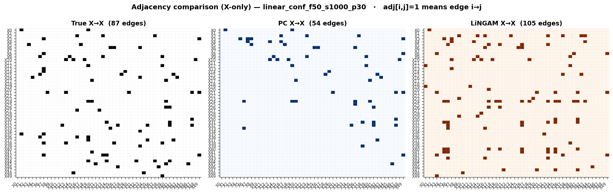

***Figure 4.1: $X \to X$ adjacency matrices for the synthetic linear-confounded dataset, where adj[i,j] = 1 denotes an edge i->j.*** The True DAG (87 edges) is shown alongside the PC (54 edges) and LiNGAM (105 edges) recoveries. PC stays close to the sparse true structure, whereas LiNGAM scatters spurious edges across the matrix, the visual signature of the over-connection that drives its low precision.

### 4.1.2 Performance Reversal on the Sachs Cell Signaling Dataset

On the real-world Sachs dataset, the performance hierarchy reverses: LiNGAM outperforms PC (F1 = 0.326 vs. 0.167; precision = 0.269 vs. 0.158). Real intracellular signaling pathways generate joint distributions with strong non-Gaussian marginals even after log1p transformation, a property that LiNGAM's functional causal model is explicitly designed to exploit. Conversely, PC's Fisher-z test assumes linear, multivariate Gaussian residuals. This introduces a known sample-size paradox: while larger sample sizes generally improve causal discovery, providing PC with a massive biological dataset (5,972 training rows compared to 800 in the synthetic side) gives the statistical tests so much power that they become hypersensitive to minor non-Gaussian distributional violations (Glymour et al., 2019; Ramsey et al., 2014). Consequently, PC loses its discriminative thresholding power under this physical complexity, leading to severe under-recovery.

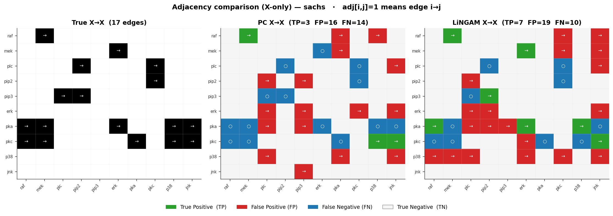

***Figure 4.2: $X \to X$ adjacency matrices for the Sachs dataset, where adj[i,j] = 1 denotes an edge i->j.*** The consensus reference DAG (17 edges) is compared against the PC (19 edges) and LiNGAM (26 edges) recoveries over the ten signaling proteins. Both algorithms recover only a fraction of the true links and introduce edges absent from the consensus network, with LiNGAM the denser of the two.

## 4.2 Graph-Free Baseline Deviation Analysis

Each combination of structure-aware Shapley method and discovered graph is compared against Traditional Shapley, the reference here being the graph-free baseline (Tag base). The two metrics of Section 3.5 are reported throughout: Magnitude Divergence $\Delta M_{\text{base}}$ and Sign Disagreement $D_{\text{base}}$, both at the global level. $\Delta M_{\text{base}}$ is a percent of the model-output standard deviation $\hat\sigma$, so a value of 0.05 means the typical attribution moved by 5% of $\hat\sigma$; $D_{\text{base}}$ is the fraction of attributions whose direction flips relative to the baseline.

<div style="display:flex; gap:2em; flex-wrap:wrap;">
<div style="flex:1; min-width:300px;">

***Table 4.1: Baseline Deviation -- Linear-Conf Synthetic Dataset. $\Delta M_{\text{base}}$ in % of model-output std; $D_{\text{base}}$ in % of attributions.***

| **Method** | **Graph** | **$D_{\text{base}}$** | **$\Delta M_{\text{base}}$** |
| --- | --- | --- | --- |
| Asymmetric | PC | 5.08% | 0.68% |
| Asymmetric | LiNGAM | 5.76% | 0.86% |
| Causal | PC | 35.30% | 6.39% |
| Causal | LiNGAM | 33.92% | 5.84% |
| Flow | PC | 36.58% | 6.62% |
| Flow | LiNGAM | 37.68% | 6.61% |

</div>
<div style="flex:1; min-width:300px;">

***Table 4.2: Baseline Deviation -- Sachs Cell Signaling Dataset. $\Delta M_{\text{base}}$ in % of model-output std; $D_{\text{base}}$ in % of attributions.***

| **Method** | **Graph** | **$D_{\text{base}}$** | **$\Delta M_{\text{base}}$** |
| --- | --- | --- | --- |
| Asymmetric | PC | 16.80% | 5.08% |
| Asymmetric | LiNGAM | 17.00% | 4.41% |
| Causal | PC | 31.30% | 7.83% |
| Causal | LiNGAM | 33.10% | 9.31% |
| Flow | PC | 40.20% | 12.68% |
| Flow | LiNGAM | 41.50% | 14.13% |

</div>
</div>

The two metrics are read jointly in Figures 4.3 and 4.4, which place each method-graph configuration on the magnitude axis ($\Delta M_{\text{base}}$, horizontal) against the sign axis ($D_{\text{base}}$, vertical). A configuration in the lower-left corner deviates little from the graph-free baseline on both axes; movement up and to the right marks growing departure in direction and magnitude respectively.

<div style="display:flex; gap:2em; flex-wrap:wrap; align-items:flex-start;">
<div style="flex:1; min-width:300px;">

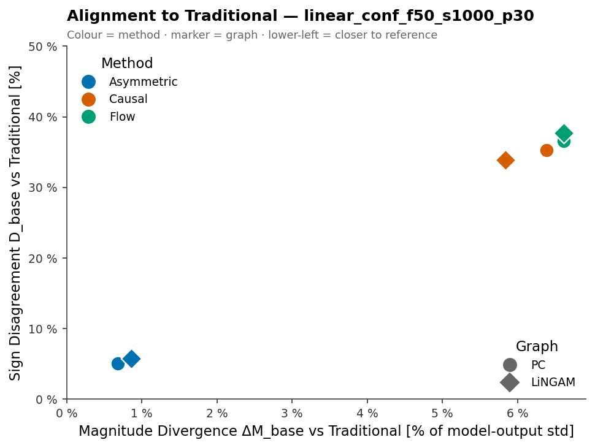

***Figure 4.3: Magnitude versus sign deviation from Traditional Shapley on the synthetic linear-confounded dataset.*** Colour encodes method and marker shape encodes the discovery algorithm. Asymmetric Shapley clusters tightly in the lower-left corner under both graphs, while Causal and Flow sit far to the upper-right, deviating strongly on both axes regardless of which graph supplies the structure.

</div>
<div style="flex:1; min-width:300px;">

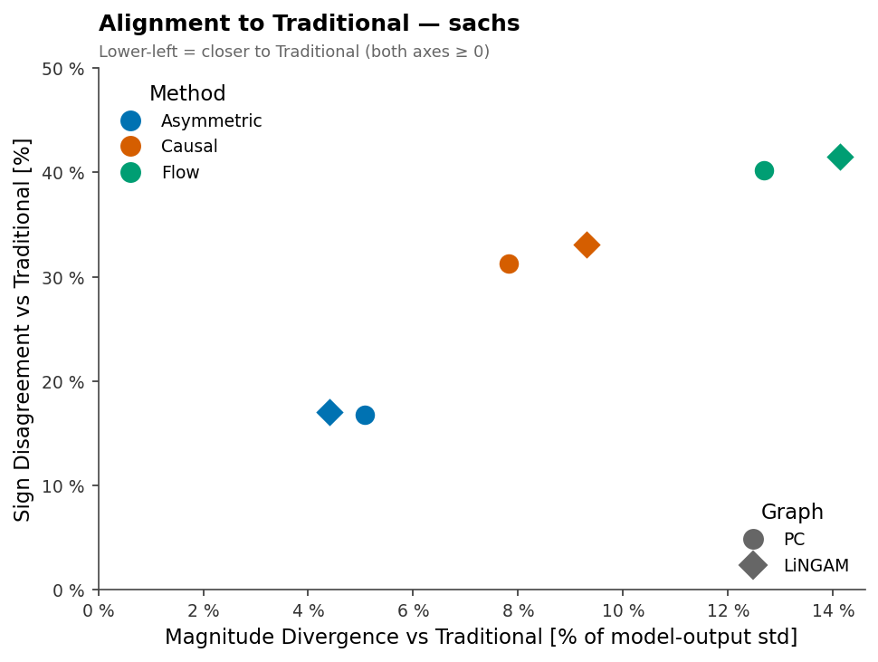

***Figure 4.4: Magnitude versus sign deviation from Traditional Shapley on the Sachs dataset ($\Delta M_{\text{base}}$ in % of model-output std).*** The same lower-left clustering of Asymmetric Shapley holds, but both axes spread wider than on synthetic and the PC/LiNGAM markers separate more visibly for Causal and Flow, the early signal of the discovery-algorithm sensitivity examined in Section 4.4.

</div>
</div>

### 4.2.1 Asymmetric Shapley -- High Robustness to Graph Injection

Asymmetric Shapley achieves the closest agreement with the Traditional Shapley baseline across both datasets. On the synthetic track, $D_{\text{base}}$ = 5.08% (PC) and 5.76% (LiNGAM), with $\Delta M_{\text{base}}$ = 0.68% and 0.86% respectively: fewer than 6% of attribution signs change and the magnitude shift is under 1% of $\hat\sigma$. On Sachs the deviation grows to $D_{\text{base}}$ 16.80-17.00% and $\Delta M_{\text{base}}$ 4.41-5.08% of $\hat\sigma$, the larger numbers reflecting the compact 10-node network where each ordering constraint binds a larger share of the graph. In both cases ASV remains the method that perturbs the baseline least.

The reason is structural: ASV changes only the permutation space and leaves the observational value function untouched, so its deviation from Traditional depends solely on how many orderings the graph forbids. The discovered graphs forbid very few — none of the PC or LiNGAM graphs form long directed chains, so most feature pairs stay order-free and the admissible permutations remain close to the full N! set. The averaging therefore runs over almost the same orderings as Traditional and the attributions barely move, least of all on the larger, sparser synthetic graph.

What movement there is concentrates on the handful of features that already dominate Traditional's global importance (taken up in Section 4.5); within a single feature the per-instance gaps delta_{i,f} = |phi_disc| - |phi_Traditional| spread roughly symmetrically about zero, so the shift is local rather than a feature-wide relocation of credit. The higher $D_{\text{base}}$ on Sachs (~17% vs ~5% synthetic) is a property of its skewed importance profile: with importance concentrated in a few proteins and a long tail of near-zero attributions, a small magnitude change easily pushes a fragile attribution across zero and registers as a sign flip.

### 4.2.2 Causal Shapley -- Intermediate Deviation with Interventional Redistribution

Causal Shapley diverges from Traditional Shapley far more than Asymmetric: $D_{\text{base}}$ = 33.92-35.30% and $\Delta M_{\text{base}}$ = 5.84-6.39% on synthetic, with $D_{\text{base}}$ 31.30-33.10% and $\Delta M_{\text{base}}$ 7.83-9.31% of $\hat\sigma$ on Sachs. Replacing observational marginalization with do-distributions redistributes credit away from features that merely correlate with the target toward those whose contribution survives interventional control, changing both the scale and the direction of roughly a third of all attributions.

Because $\Delta M_{\text{base}}$ is magnitude-only, the signed instance-level gap delta_{i,f} = |phi_Causal| - |phi_Traditional| recovers the direction of each change and, with it, a feature's causal role. Source nodes have no parents to condition on and become the targets of the do-intervention, absorbing the credit that interventional sampling strips from their descendants, so they tend to gain magnitude and sit on the positive side. Intermediate nodes are resampled from a parent-conditioned interventional distribution and tend to lose magnitude, sitting on the negative side. This source-versus-intermediate split is visible on both the synthetic and Sachs tracks; the specific features that exemplify it are examined in Section 4.5.

### 4.2.3 Shapley Flow -- High Deviation with Sign Instability

Shapley Flow shows the highest Sign Disagreement on the synthetic dataset ($D_{\text{base}}$ = 36.58-37.68%) and the largest magnitude deviation overall, reaching $\Delta M_{\text{base}}$ = 14.13% of $\hat\sigma$ on Sachs under LiNGAM. The two move together: re-routing credit along edges produces large magnitude shifts, and the larger the magnitude shift the more often it is large enough to carry an attribution across zero and invert its sign. Flow's high magnitude deviation is therefore the direct cause of its high sign instability.

Read per feature, the signed instance-level gap again has a structural meaning, but for Flow the discriminating quantity is the node's balance of incoming to outgoing edges. A node's attribution is the sum of its outgoing edge credits, so a feature with many incoming edges spends its activation propagating its parents' credit forward and tends to lose magnitude (negative side), while a feature with a high outgoing-to-incoming ratio accumulates edge credit and tends to gain it (positive side). On Sachs the per-feature median does not change side between the PC and LiNGAM graphs, so the cleaner signal there is the width of the per-instance spread, with very wide dispersion flagging a likely high incoming-to-outgoing ratio. The features that best illustrate these mechanisms, including cases where a node's edge balance flips between the two discovered graphs, are deferred to Section 4.5.

The feature-level magnitude deviations summarized by the global $\Delta M_{\text{base}}$ are shown in full in Figures 4.5 and 4.6, which lay out the per-feature $\Delta M_{\text{base}}$ against Traditional Shapley for the top features of each dataset across all six method-graph combinations. The heatmaps make the method hierarchy visually immediate: the two Asymmetric rows are almost uniformly pale, while the Causal and Flow rows darken sharply on the highest-importance features (X24, X33, X47 on synthetic; erk, pka on Sachs), confirming that the magnitude shift concentrates on a small set of dominant features and is driven by the interventional and edge-routing methods rather than by Asymmetric.

<div style="display:flex; gap:2em; flex-wrap:wrap; align-items:flex-start;">
<div style="flex:1; min-width:300px;">

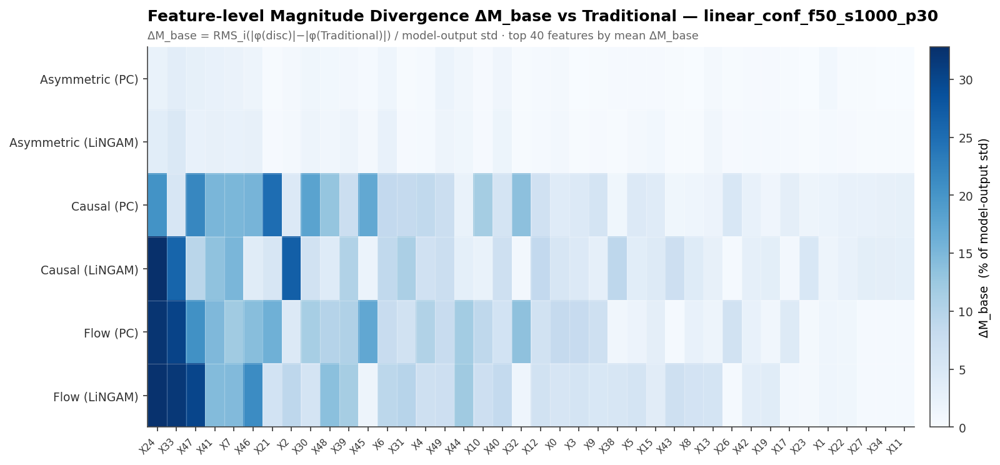

***Figure 4.5: Feature-level Magnitude Divergence $\Delta M_{\text{base}}$ vs. Traditional Shapley, synthetic dataset (top 40 features by mean $\Delta M_{\text{base}}$, in % of model-output std).*** Rows are method-graph combinations; columns are features. The Asymmetric rows are near-zero throughout, while Causal and Flow concentrate their largest deviations on X24, X33 and X47.

</div>
<div style="flex:1; min-width:300px;">

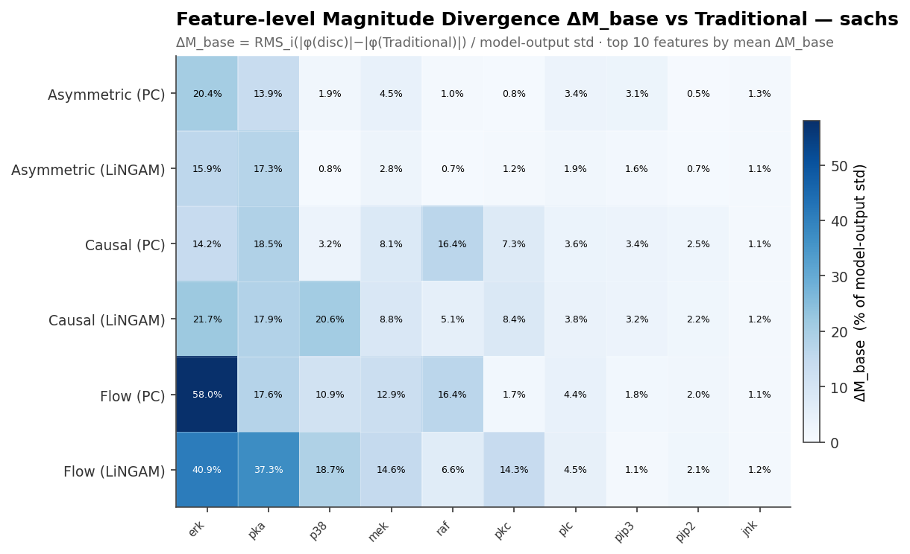

***Figure 4.6: Feature-level Magnitude Divergence $\Delta M_{\text{base}}$ vs. Traditional Shapley, Sachs dataset (top 10 features by mean $\Delta M_{\text{base}}$, in % of model-output std).*** The deviation concentrates on erk and pka, with Flow under PC producing the single largest feature-level shift (erk, 57.9% of $\hat\sigma$).

</div>
</div>

## 4.3 True-Graph Causal Alignment

The oracle-alignment analysis measures how closely each combination of structure-aware Shapley method and discovered graph recovers the attributions that would be obtained with the oracle graph as input. On the synthetic track the oracle is the True DAG; on Sachs it is the consensus reference DAG, which plays the same role. Tables 4.3 and 4.4 report $\Delta M_{\text{oracle}}$ and $D_{\text{oracle}}$ for each track, and Figures 4.7 and 4.8 place every configuration on the magnitude axis ($\Delta M_{\text{oracle}}$) against the sign axis ($D_{\text{oracle}}$), where the lower-left corner marks the closest recovery of the oracle attributions.

<div style="display:flex; gap:2em; flex-wrap:wrap; align-items:flex-start;">
<div style="flex:1; min-width:300px;">

***Table 4.3: Oracle Alignment -- Linear-Conf Synthetic Dataset. $\Delta M_{\text{oracle}}$ in % of model-output std; $D_{\text{oracle}}$ in % of attributions.***

| **Method** | **Graph** | $D_{\text{oracle}}$ | $\Delta M_{\text{oracle}}$ |
| --- | --- | --- | --- |
| Asymmetric | PC | 5.88% | 1.02% |
| Asymmetric | LiNGAM | 6.30% | 0.79% |
| Causal | PC | 31.60% | 5.32% |
| Causal | LiNGAM | 37.46% | 7.57% |
| Flow | PC | 42.26% | 7.34% |
| Flow | LiNGAM | 44.91% | 8.06% |

</div>
<div style="flex:1; min-width:300px;">

***Table 4.4: Oracle Alignment -- Sachs Cell Signaling Dataset (oracle = consensus DAG). $\Delta M_{\text{oracle}}$ in % of model-output std; $D_{\text{oracle}}$ in % of attributions.***

| **Method** | **Graph** | $D_{\text{oracle}}$ | $\Delta M_{\text{oracle}}$ |
| --- | --- | --- | --- |
| Asymmetric | PC | 24.20% | 9.16% |
| Asymmetric | LiNGAM | 23.40% | 2.84% |
| Causal | PC | 36.30% | 9.01% |
| Causal | LiNGAM | 32.30% | 8.31% |
| Flow | PC | 28.36% | 15.52% |
| Flow | LiNGAM | 23.81% | 8.12% |

</div>
</div>

<div style="display:flex; gap:2em; flex-wrap:wrap; align-items:flex-start;">
<div style="flex:1; min-width:300px;">

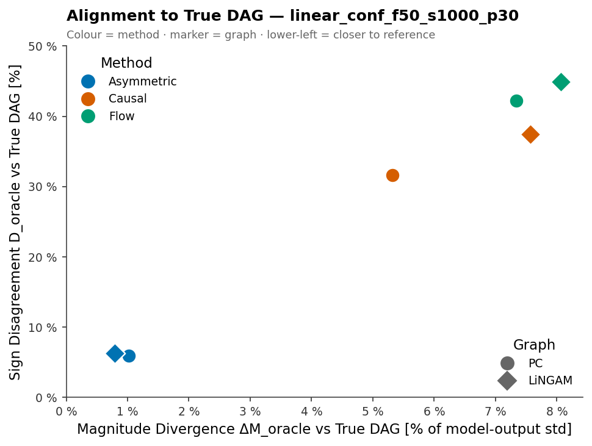

***Figure 4.7: Magnitude versus sign deviation from the True DAG oracle, synthetic dataset.*** Colour encodes method, marker shape encodes the discovery algorithm. Asymmetric Shapley sits in the lower-left corner under both graphs, recovering the oracle attributions almost exactly, while Causal and Flow sit far up and to the right.

</div>
<div style="flex:1; min-width:300px;">

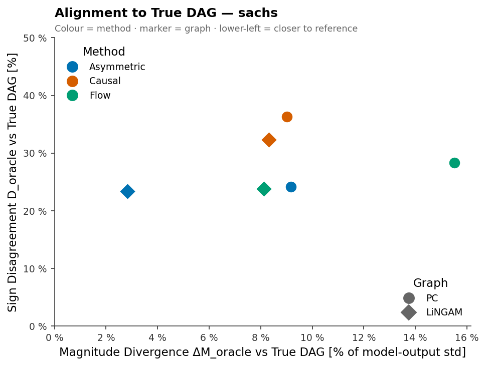

***Figure 4.8: Magnitude versus sign deviation from the consensus DAG oracle, Sachs dataset ($\Delta M_{\text{oracle}}$ in % of model-output std).*** The lower-left ordering is less clean than on the synthetic track: Asymmetric still aligns best on magnitude, but the sign axis compresses the three methods together and the PC/LiNGAM markers separate widely on magnitude.

</div>
</div>

### 4.3.1 Asymmetric Shapley -- Near-Perfect Oracle Fidelity

On the synthetic dataset ASV achieves the highest alignment with the True DAG oracle: $D_{\text{oracle}}$ = 5.88% (PC) and 6.30% (LiNGAM), with $\Delta M_{\text{oracle}}$ = 1.02% and 0.79% of $\hat\sigma$ respectively. Despite LiNGAM injecting 81 false-positive edges, the additional ordering constraints introduced by these edges minimally affect the attribution magnitudes. In a 50-node sparse system, the true and discovered graphs share most of their valid topological orderings, producing nearly identical attributions regardless of graph source.

On Sachs the picture is the same in relative terms but coarser in absolute terms: ASV again has the lowest sign disagreement ($D_{\text{oracle}}$ = 23.40-24.20%) and the lowest magnitude deviation, with LiNGAM in particular reaching $\Delta M_{\text{oracle}}$ = 2.84% of $\hat\sigma$ against the consensus oracle, the closest oracle recovery of any configuration on the real track. The larger sign-disagreement floor (~24%, versus ~6% on synthetic) reflects the compact 10-node network, where each discovery error constrains a larger fraction of the available orderings.

Notably, the quality of the discovered graph confers no directional advantage here. Inspecting the instance-level gap against the oracle feature by feature, the distributions are centred close to zero with high variance under both PC and LiNGAM, with no feature showing a systematic tendency to align with or oppose the True DAG attributions. The much higher F1 of PC on synthetic (0.567 vs. 0.250) does not translate into visibly better oracle alignment for ASV than LiNGAM, and on Sachs the more accurate LiNGAM graph (F1 0.326 vs. PC's 0.167) is only marginally closer. Because ASV's averaging is insensitive to all but the orderings a graph forbids, and the discovered graphs forbid few, the recovered attributions are essentially the same whichever graph is supplied, regardless of its discovery accuracy.

### 4.3.2 Causal and Flow -- Compounding Error Under Imprecise Graphs

CSV and Shapley Flow show substantial vulnerability to graph prior distortion. For CSV, LiNGAM's 81 false-positive edges inject spurious parent relationships into the interventional conditioning procedure. Each false parent link causes CSV to compute post-interventional distributions that do not correspond to any real causal mechanism, misrouting attribution credit. On synthetic this yields $D_{\text{oracle}}$ = 37.46% and $\Delta M_{\text{oracle}}$ = 7.57% of $\hat\sigma$ for CSV+LiNGAM; PC's more conservative graph reduces but does not eliminate the distortion ($D_{\text{oracle}}$ = 31.60%, $\Delta M_{\text{oracle}}$ = 5.32%).

Shapley Flow shows the largest sign disagreement with the oracle on synthetic: $D_{\text{oracle}}$ = 42.26-44.91%, meaning close to half of all attributions point in the wrong direction relative to the True DAG. PC's under-connected graph removes pathways along which credit should flow, and LiNGAM's over-connected graph creates excessive edge competition. $\Delta M_{\text{oracle}}$ = 7.34-8.06% of $\hat\sigma$ confirms that the magnitude scale is also substantially distorted in both cases.

The Sachs track qualifies this synthetic picture in two ways. First, the CSV ordering between graphs reverses: CSV+LiNGAM ($D_{\text{oracle}}$ = 32.30%) aligns slightly better with the consensus oracle than CSV+PC (36.30%), consistent with LiNGAM being the stronger discovery algorithm on the real non-Gaussian data (Section 4.1.2). Second, Flow is markedly less sign-unstable on Sachs ($D_{\text{oracle}}$ = 23.81-28.36%) than on synthetic, although it still carries the largest magnitude deviations ($\Delta M_{\text{oracle}}$ up to 15.52% of $\hat\sigma$ for Flow+PC). The contrast indicates that Flow's extreme synthetic sign instability is partly a property of the dense, heavily mis-oriented synthetic graphs rather than an invariant of the method.

The feature-level breakdown of these oracle deviations is shown in Figures 4.9 and 4.10. As with the Traditional-reference heatmaps, the Asymmetric rows stay pale across nearly all features while Causal and Flow darken on the dominant ones, but two details stand out. On synthetic, Flow under PC produces the single darkest cell on X33, the feature isolated as a spurious root by PC's edge reversals (examined in Section 4.5). On Sachs, Flow under PC reaches a feature-level $\Delta M_{\text{oracle}}$ of 49.2% of $\hat\sigma$ on erk, the protein whose parent links PC deletes, again concentrating the worst oracle deviation on a single mis-oriented node.

<div style="display:flex; gap:2em; flex-wrap:wrap; align-items:flex-start;">
<div style="flex:1; min-width:300px;">

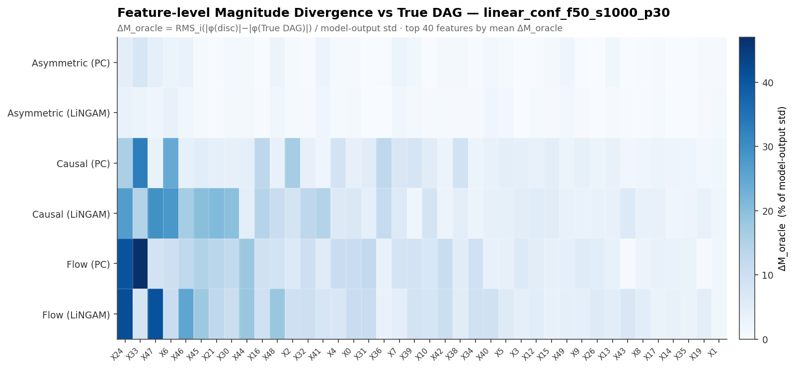

***Figure 4.9: Feature-level Magnitude Divergence $\Delta M_{\text{oracle}}$ vs. the True DAG oracle, synthetic dataset (top 40 features by mean $\Delta M_{\text{oracle}}$, in % of model-output std).*** Asymmetric rows are near-zero; Causal and Flow concentrate their oracle deviations on X24, X33, X47 and X6.

</div>
<div style="flex:1; min-width:300px;">

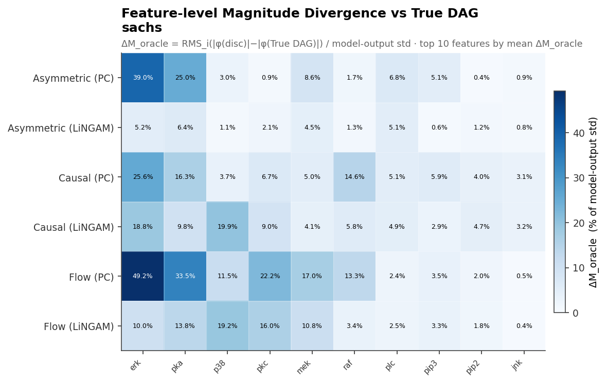

***Figure 4.10: Feature-level Magnitude Divergence $\Delta M_{\text{oracle}}$ vs. the consensus DAG oracle, Sachs dataset (top 10 features by mean $\Delta M_{\text{oracle}}$, in % of model-output std).*** Flow under PC produces the largest single deviation on erk (49.2% of $\hat\sigma$), the protein PC isolates by deleting its parent links.

</div>
</div>

## 4.4 Discovery Algorithm Sensitivity Analysis

Tables 4.5 and 4.6 quantify how much the choice between PC and LiNGAM affects the final attributions for each Shapley method, reporting the cross-discovery Magnitude Divergence $\Delta M_{\text{disc}}$ (magnitude difference between the PC and LiNGAM variants) and Sign Disagreement $D_{\text{disc}}$ (the rate at which the two variants disagree on attribution sign). Both use the opposite discovered graph as the reference. Figures 4.11 and 4.12 plot the two quantities against each other; the lower-left corner marks a method whose attributions are stable across the choice of discovery algorithm on both axes.

<div style="display:flex; gap:2em; flex-wrap:wrap; align-items:flex-start;">
<div style="flex:1; min-width:300px;">

***Table 4.5: PC vs. LiNGAM Sensitivity -- Linear-Conf Synthetic Dataset. $\Delta M_{\text{disc}}$ in % of model-output std; $D_{\text{disc}}$ in % of attributions.***

| **Method** | $\Delta M_{\text{disc}}$ | $D_{\text{disc}}$ |
| --- | --- | --- |
| Asymmetric | 1.07% | 5.93% |
| Causal | 7.15% | 37.94% |
| Flow | 6.06% | 13.27% |

</div>
<div style="flex:1; min-width:300px;">

***Table 4.6: PC vs. LiNGAM Sensitivity -- Sachs Cell Signaling Dataset. $\Delta M_{\text{disc}}$ in % of model-output std; $D_{\text{disc}}$ in % of attributions.***

| **Method** | $\Delta M_{\text{disc}}$ | $D_{\text{disc}}$ |
| --- | --- | --- |
| Asymmetric | 8.46% | 18.60% |
| Causal | 10.11% | 31.80% |
| Flow | 14.92% | 21.88% |

</div>
</div>

<div style="display:flex; gap:2em; flex-wrap:wrap; align-items:flex-start;">
<div style="flex:1; min-width:300px;">

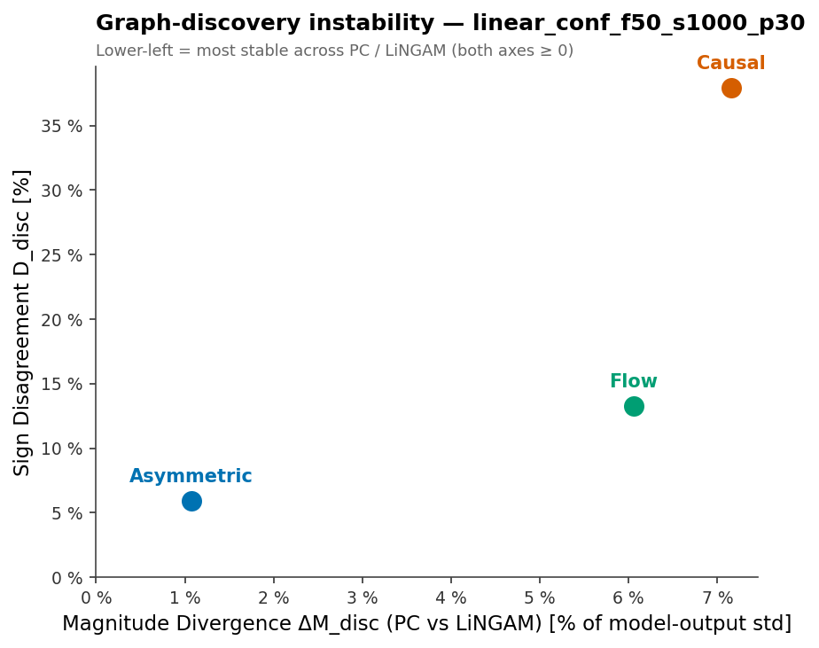

***Figure 4.11: Graph-discovery instability, synthetic dataset.*** Each point is one Shapley method, positioned by its Magnitude Divergence ($\Delta M_{\text{disc}}$, horizontal) and Sign Disagreement ($D_{\text{disc}}$, vertical) between the PC and LiNGAM variants. Asymmetric sits in the lower-left (stable on both axes), Causal in the upper-right (unstable on both), and Flow in between, magnitude-sensitive but comparatively sign-stable.

</div>
<div style="flex:1; min-width:300px;">

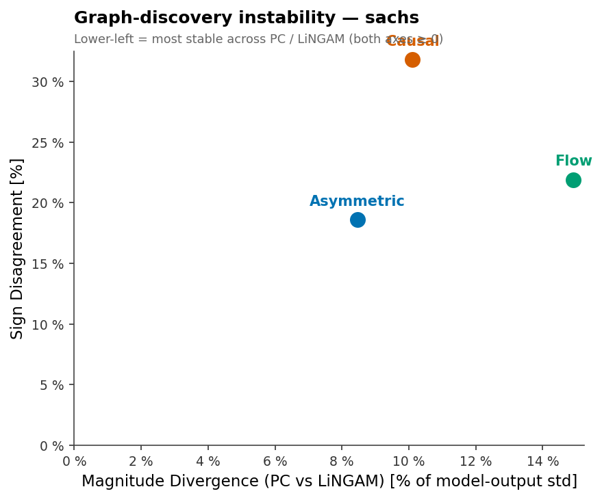

***Figure 4.12: Graph-discovery instability, Sachs dataset ($\Delta M_{\text{disc}}$ in % of model-output std).*** The same ordering holds, with both axes wider than on synthetic; Causal remains the most sign-unstable while Flow carries the largest magnitude difference between graphs.

</div>
</div>

### 4.4.1 Asymmetric Shapley -- Minimal Sensitivity on Synthetic

On the synthetic dataset, ASV shows the lowest sensitivity to discovery algorithm choice: $\Delta M_{\text{disc}}$ = 1.07% of $\hat\sigma$, $D_{\text{disc}}$ = 5.93%. Only about 1 in 17 attribution signs differs between the PC and LiNGAM variants. In high-dimensional sparse settings, both graphs leave most ordering relationships unconstrained and ASV's permutation sampling produces nearly identical attribution distributions regardless of which graph is supplied.

On the Sachs dataset, sensitivity increases substantially to $\Delta M_{\text{disc}}$ = 8.46% of $\hat\sigma$ and $D_{\text{disc}}$ = 18.6%. In the compact 10-node network, the different edge sets discovered by PC and LiNGAM impose materially different topological constraints, and these differences accumulate into visible attribution changes.

### 4.4.2 Causal and Flow -- High Sensitivity, Especially on Real Data

CSV and Shapley Flow are substantially more sensitive to discovery algorithm choice, but in different ways. On the synthetic dataset, CSV's $\Delta M_{\text{disc}}$ = 7.15% and Flow's $\Delta M_{\text{disc}}$ = 6.06% of $\hat\sigma$ are roughly 7 and 6 times larger than ASV's. The sign axis separates the two methods: CSV's $D_{\text{disc}}$ = 37.94% is the highest instability in the synthetic experiment, because interventional conditioning inverts attribution signs whenever the parent sets differ between graphs, which happens frequently given LiNGAM's 81 spurious edges. Flow, by contrast, is much more sign-stable on synthetic ($D_{\text{disc}}$ = 13.27%) despite its comparable magnitude sensitivity: its sign instability relative to the oracle (Section 4.3) comes largely from disagreement with the True DAG rather than between the two discovered graphs, which share many of the same orientation errors.

On the Sachs dataset, the magnitude instability escalates: CSV's $\Delta M_{\text{disc}}$ = 10.11% and Flow's $\Delta M_{\text{disc}}$ = 14.92% of $\hat\sigma$ mean that choosing LiNGAM over PC moves CSV and Flow attributions by more than a tenth of the model-output standard deviation, so the discovery algorithm becomes a dominant source of attribution variance. The sign-disagreement rates converge somewhat (CSV $D_{\text{disc}}$ = 31.80%, Flow 21.88%), with CSV remaining the most sign-unstable method on both tracks. The feature-level heatmaps in Figures 4.13 and 4.14 show that this instability is again carried by a few features: on synthetic $\Delta M_{\text{disc}}$ concentrates on X33 and X47, and on Sachs almost entirely on erk and pka, the same dominant nodes that drive every other comparison in this chapter.

<div style="display:flex; gap:2em; flex-wrap:wrap; align-items:flex-start;">
<div style="flex:1; min-width:300px;">

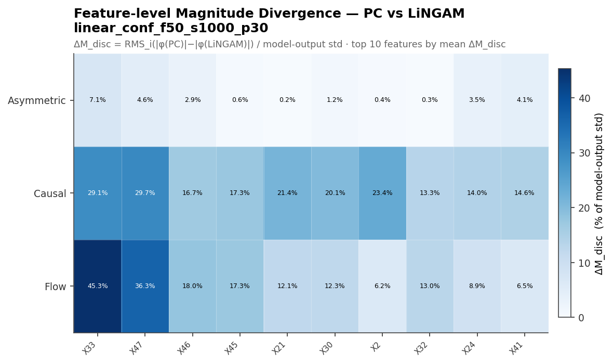

***Figure 4.13: Feature-level cross-discovery Magnitude Divergence $\Delta M_{\text{disc}}$ (PC vs. LiNGAM), synthetic dataset (top 40 features by mean $\Delta M_{\text{disc}}$, in % of model-output std).*** The Asymmetric row is near-zero; Causal and Flow concentrate their PC-vs-LiNGAM magnitude differences on X33 and X47, with Flow producing the single darkest cell on X33.

</div>
<div style="flex:1; min-width:300px;">

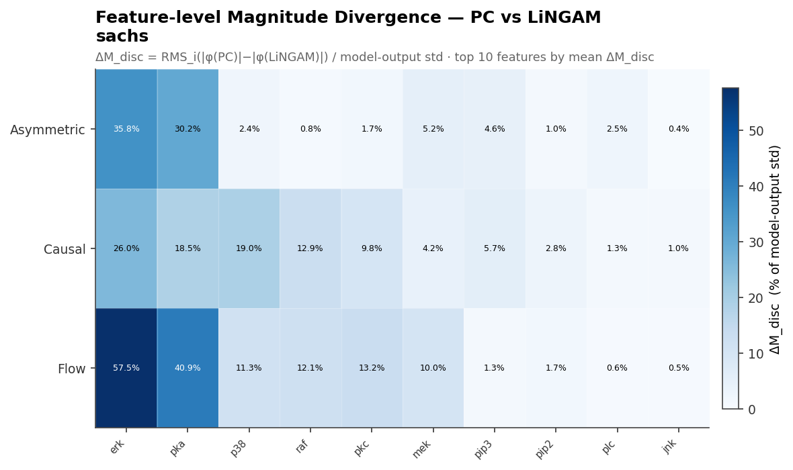

***Figure 4.14: Feature-level cross-discovery Magnitude Divergence $\Delta M_{\text{disc}}$ (PC vs. LiNGAM), Sachs dataset (top 10 features by mean $\Delta M_{\text{disc}}$, in % of model-output std).*** The sensitivity concentrates on erk and pka across all three methods, with Flow reaching a feature-level $\Delta M_{\text{disc}}$ of 57.5% of $\hat\sigma$ on erk.

</div>
</div>

## 4.5 Granular Case Studies

Three archetypal error mechanisms illustrate the micro-level behavior observed across both experimental tracks. Each is identified by tracing a large global or feature-level metric back to a specific discovery error, using the True DAG (or the Sachs consensus DAG) as the reference for what the correct local structure should have been.

### 4.5.1 Out-Degree Inflation and Root Cause Overloading

Interventional frameworks (CSV) and edge-routing models (Flow) over-inflate the attribution of any node that a discovered graph misrepresents as a high-degree root source. The clearest synthetic case is X24, a true direct parent of Y with 3 incoming and 4 outgoing edges in the True DAG (Figure 4.15). Both PC and LiNGAM strip its true parents and add spurious children (Figure 4.16), recasting it as an apparent high out-degree source; this inflates its interventional parent set under CSV and its outgoing-edge credit under Flow, so it absorbs compounded attribution from paths that do not exist in the true graph.

<div style="display:flex; gap:2em; flex-wrap:wrap; align-items:flex-start;">
<div style="flex:1; min-width:300px;">

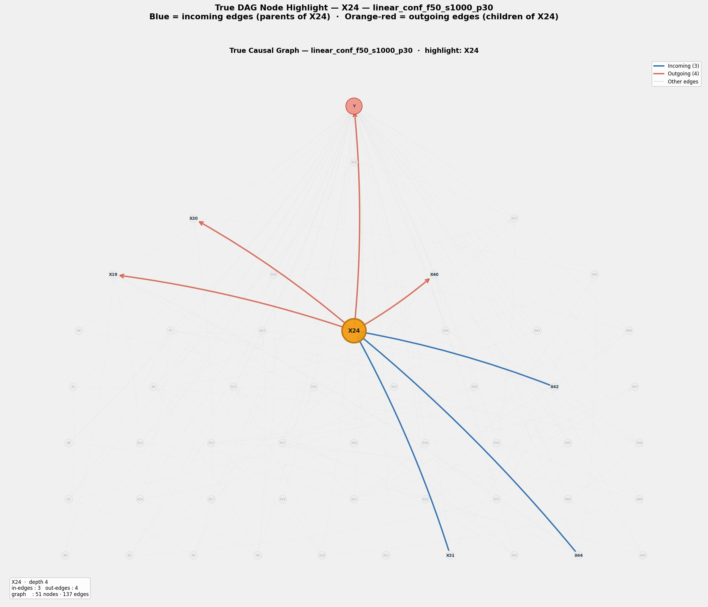

***Figure 4.15: True-DAG neighbourhood of X24, synthetic dataset.*** Blue edges are incoming (parents), orange-red edges are outgoing (children). X24 is a true direct parent of Y with 3 parents and 4 children.

</div>
<div style="flex:1; min-width:300px;">

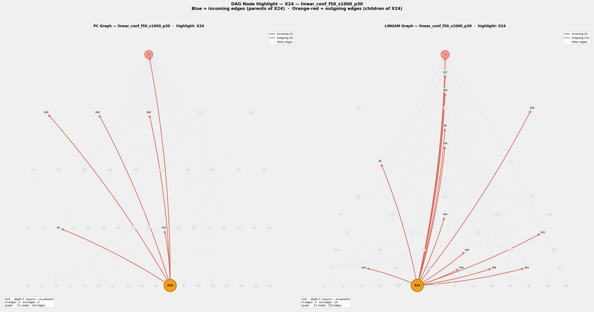

***Figure 4.16: Discovered neighbourhoods of X24 under PC (left) and LiNGAM (right).*** Both graphs strip X24's true incoming edges and add spurious outgoing ones (6 out-edges under PC, 14 under LiNGAM, 0 in-edges in both), recasting a mid-graph node as an apparent root source.

</div>
</div>

X47 shows the complementary pattern driven by edge reversal. In the True DAG it has 3 incoming and 1 outgoing edge. LiNGAM reverses its incoming edges and isolates it as an apparent root source, which causes Flow to inflate its attribution well above the oracle (feature-level $\Delta M_{\text{oracle}}$ = 41.2% of $\hat\sigma$). PC, by contrast, recovers X47's incoming edges essentially correctly, and its feature-level $\Delta M_{\text{oracle}}$ is far lower (8.6%). This split is visible in the Flow SHAP scatter (Figure 4.18): the X47 magnitudes under Flow+PC track Flow+True closely, while Flow+LiNGAM is widely inflated.

<div style="display:flex; gap:2em; flex-wrap:wrap; align-items:flex-start;">
<div style="flex:1; min-width:300px;">

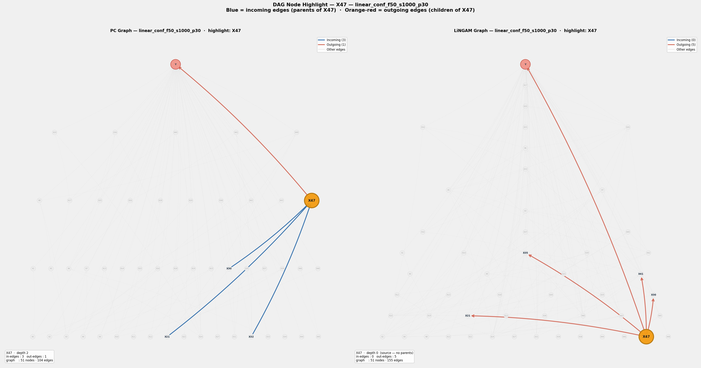

***Figure 4.17: Discovered neighbourhoods of X47 under PC (left) and LiNGAM (right).*** PC recovers X47's incoming edges accurately (depth 2, 3 in-edges), whereas LiNGAM reverses them, leaving X47 as a 0-in / 5-out apparent source.

</div>
<div style="flex:1; min-width:300px;">

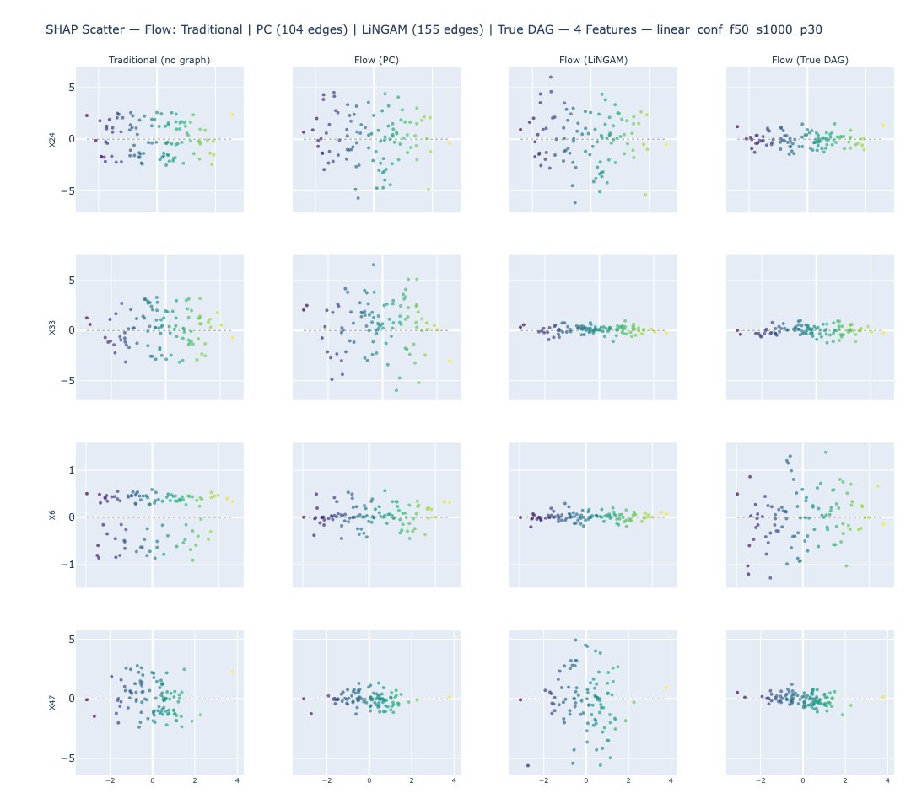

***Figure 4.18: Shapley Flow SHAP scatter (value vs. feature value) for X24, X33, X6 and X47, under Traditional, PC, LiNGAM and the True DAG, synthetic dataset.*** For X47, the Flow+PC and Flow+True columns show closely matching magnitudes, while Flow+LiNGAM is visibly inflated, the scatter-level signature of the reversal-induced root-source overloading.

</div>
</div>

The same mechanism appears on Sachs through protein pka, a dominant predictor and near-root source (1 incoming, 6 outgoing edges in the consensus DAG; Figure 4.20). LiNGAM keeps it almost correct — a pure root with 7 outgoing edges — giving an Asymmetric $\Delta M_{\text{oracle}}$ of just 6.4% of $\hat\sigma$, whereas PC reverses several outgoing edges into a 3-in/3-out node, and that mis-orientation cascades downstream to raise pka's Asymmetric $\Delta M_{\text{oracle}}$ to 25.0%. The asymmetry carries to Flow, where Flow+LiNGAM tracks the oracle but Flow+PC underestimates pka's explainability.

<div style="display:flex; gap:2em; flex-wrap:wrap; align-items:flex-start;">
<div style="flex:1; min-width:300px;">

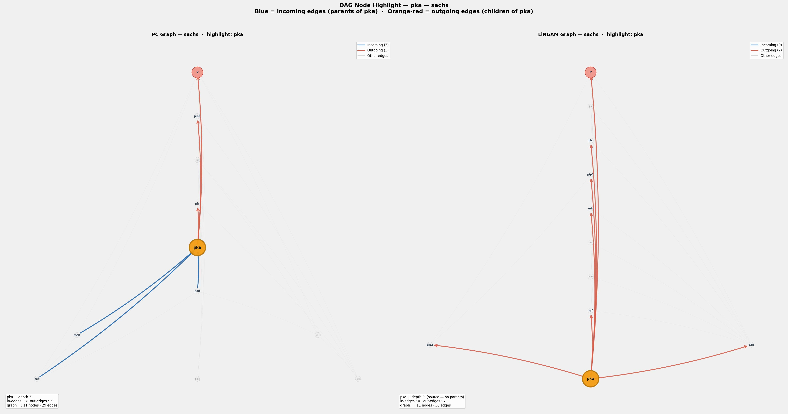

***Figure 4.19: Discovered neighbourhoods of pka under PC (left) and LiNGAM (right), Sachs dataset.*** PC gives pka 3 incoming and 3 outgoing edges, reversing several true outgoing links, while LiNGAM keeps it a pure root with 7 outgoing edges and none incoming, much closer to the consensus structure.

</div>
<div style="flex:1; min-width:300px;">

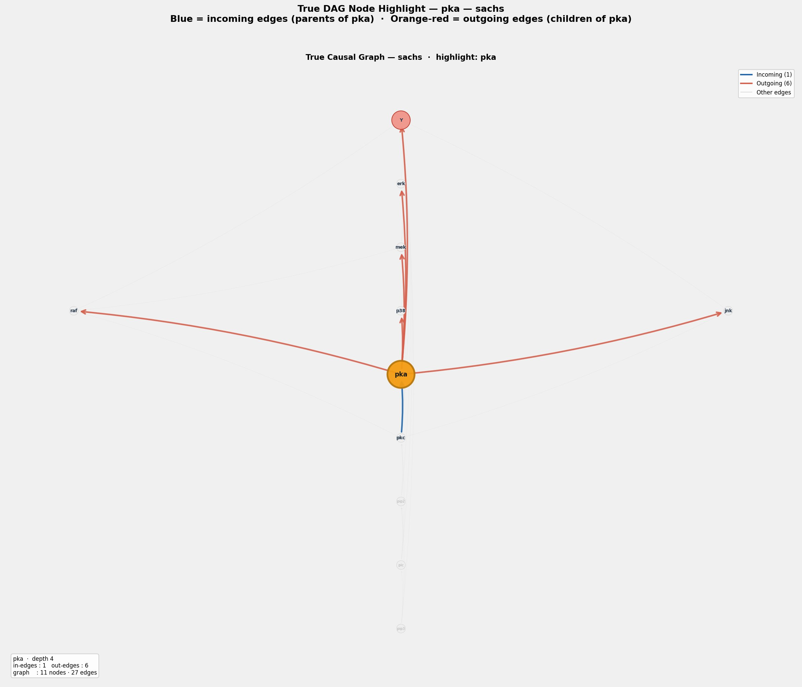

***Figure 4.20: Consensus-DAG neighbourhood of pka, Sachs dataset.*** pka is a near-root source with 1 incoming and 6 outgoing edges; the PC reversal that adds spurious incoming edges is what drives its $\Delta M_{\text{oracle}}$ from 6.4% of $\hat\sigma$ (LiNGAM) up to 25.0% (PC).

</div>
</div>

### 4.5.2 Directed Edge Inversion and Causal Credit Transfer

This mechanism showcases the attribution penalty that occurs when a discovery algorithm reverses the direction of a true edge. On the synthetic dataset, PC incorrectly assigns the edge $X_{21} \to X_{47}$. X21 has traditionally low explainability and, by construction of the data-generating process, has no relation to Y; X47, in contrast, is a dominant direct parent of Y. Under both CSV and Shapley Flow this reversal forces X21 to precede X47, allowing X21 to absorb marginal contributions that should belong exclusively to X47, through the two methods' respective mechanisms: Causal Shapley inserts X21 as a false parent in X47's interventional conditioning set, contaminating the post-interventional distribution and reducing X47's own explainability when it is sampled out of coalition, while Flow's outgoing-edge assignment routes credit out of X21 along the spurious edge. The trail that led to this case is the feature-level $\Delta M_{\text{disc}}$: X47's $\Delta M_{\text{disc}}$ reaches 29.8% of $\hat\sigma$ for CSV, among the highest in the synthetic experiment, which is precisely the signal that flagged X47 as worth inspecting and connects the global sensitivity metric to the local discovery error behind it.

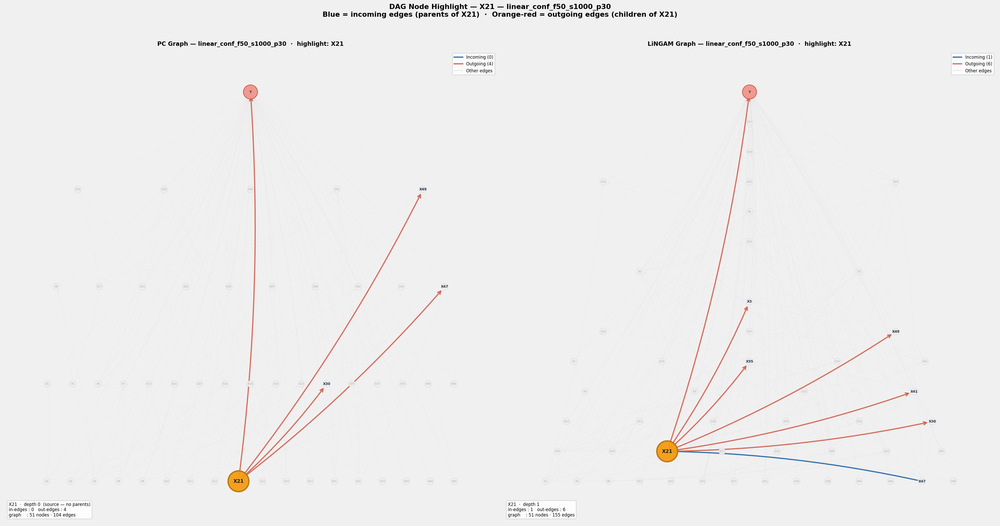

***Figure 4.21: Discovered neighbourhoods of X21 under PC (left) and LiNGAM (right).*** The X21-X47 link is oriented differently across graphs; under the configuration that places X21 upstream of X47, X21 absorbs credit that belongs to X47.

<div style="display:flex; gap:2em; flex-wrap:wrap; align-items:flex-start;">
<div style="flex:1; min-width:300px;">

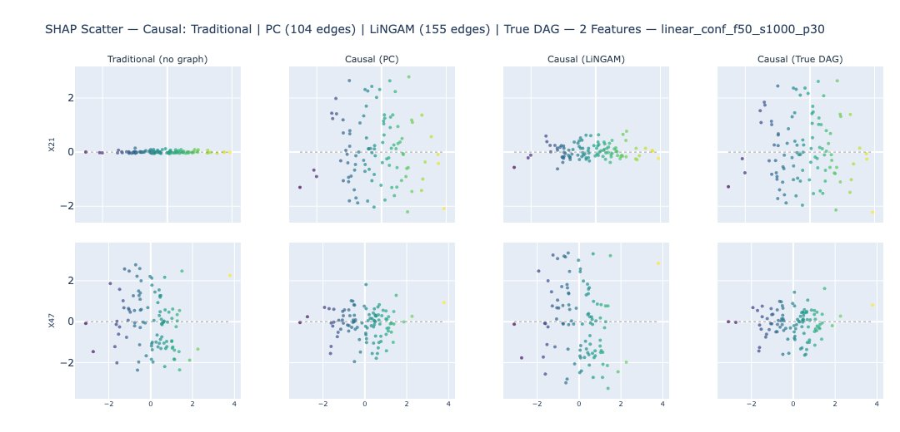

***Figure 4.22: Causal Shapley SHAP scatter for X21 and X47 across Traditional, PC, LiNGAM and the True DAG, synthetic dataset.*** Under the graph that reverses X21-X47, X21 acquires non-trivial attribution despite having no true relation to Y, while X47's attribution is suppressed relative to the oracle.

</div>
<div style="flex:1; min-width:300px;">

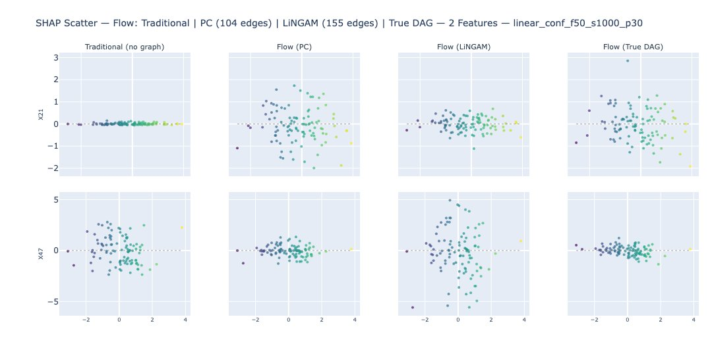

***Figure 4.23: Shapley Flow SHAP scatter for X21 and X47 across the same four configurations.*** The same credit transfer appears under Flow's edge-routing mechanism, confirming that the inversion penalty is not specific to the interventional method.

</div>
</div>

### 4.5.3 Confounded Subordination and Boundary Isolation

Synthetic feature X6 is a true intermediate channel with 3 parents and 4 children. Under LiNGAM its parent set is inflated by roughly eight false incoming links (in-degree 8 in the LiNGAM graph against 3 in the True DAG), and under CSV these false parents generate an overly constrained post-interventional distribution for X6, yielding a feature-level $\Delta M_{\text{oracle}}$ of 28.1% of $\hat\sigma$, among the highest in the synthetic confounded track. X6 is a clean illustration of LiNGAM's poor precision and recall translating directly into attribution error: because the discovery algorithm attributes far more incoming connections to the node than truly exist, the interventional conditioning set is contaminated, and the discovery-quality failure becomes a Causal Shapley failure. This makes the precision and recall of the discovery step a direct and visible factor in CSV's reliability.

<div style="display:flex; gap:2em; flex-wrap:wrap; align-items:flex-start;">
<div style="flex:1; min-width:300px;">

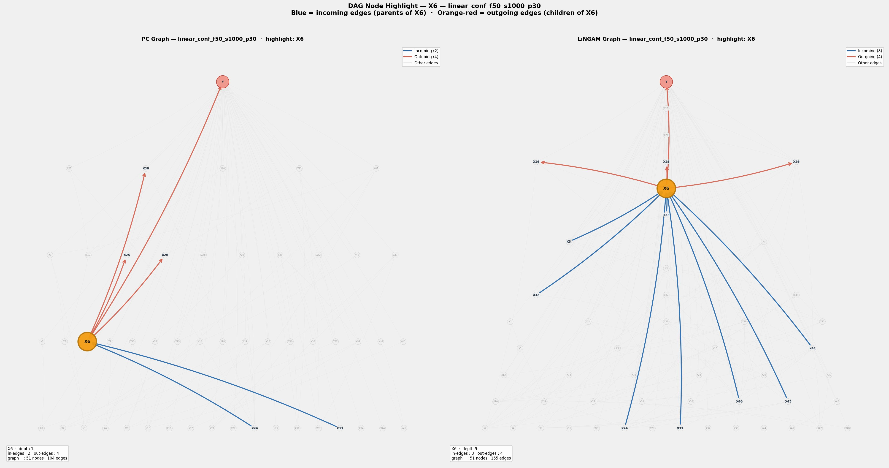

***Figure 4.24: Discovered neighbourhoods of X6 under PC (left) and LiNGAM (right).*** LiNGAM inflates X6's in-degree to 8 against a true value of 3 (Figure 4.25), the over-connection that contaminates its interventional parent set under Causal Shapley.

</div>
<div style="flex:1; min-width:300px;">

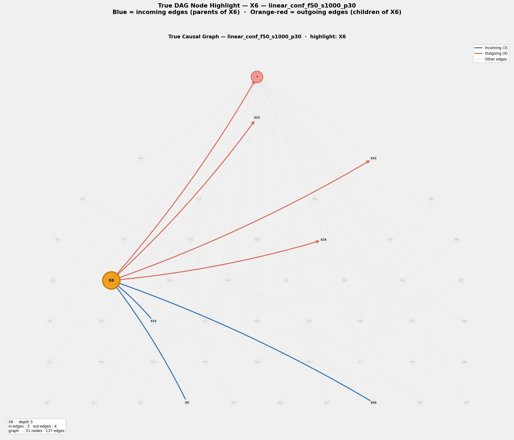

***Figure 4.25: True-DAG neighbourhood of X6, synthetic dataset.*** X6 is a genuine intermediate node with 3 incoming and 4 outgoing edges.

</div>
</div>

On the Sachs dataset, protein erk is a downstream node that in the consensus DAG receives inputs from pka and mek. PC discovers a markedly different configuration, removing erk's parent links and isolating it as an apparent root node with several outgoing edges. Under Shapley Flow this isolation assigns erk a disproportionately large attribution, because with no incoming edges and many outgoing ones it accumulates outgoing-edge credit that the true structure would have distributed to its parents (feature-level $\Delta M_{\text{oracle}}$ = 49.2% of $\hat\sigma$ for Flow+PC, the largest in the real-data experiment).

<div style="display:flex; gap:2em; flex-wrap:wrap; align-items:flex-start;">
<div style="flex:1; min-width:300px;">

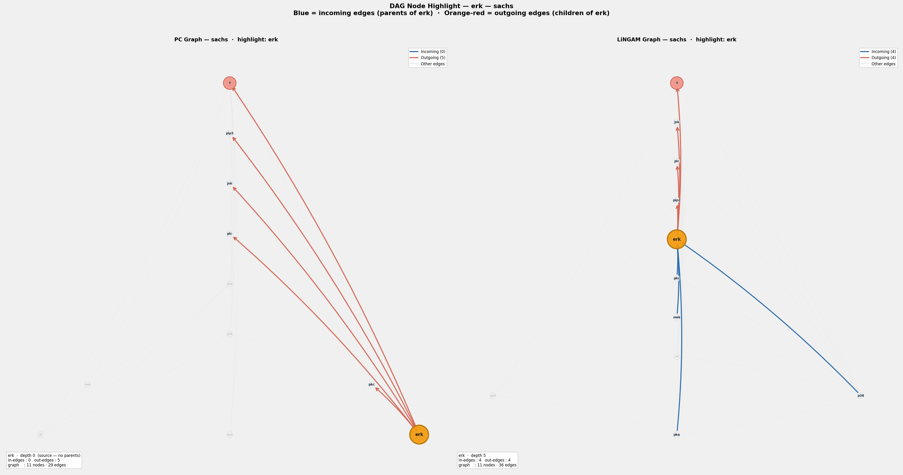

***Figure 4.26: Discovered neighbourhoods of erk under PC (left) and LiNGAM (right), Sachs dataset.*** PC removes erk's true incoming edges from pka and mek and leaves it with outgoing edges only, recasting a downstream node as a boundary source.

</div>
<div style="flex:1; min-width:300px;">

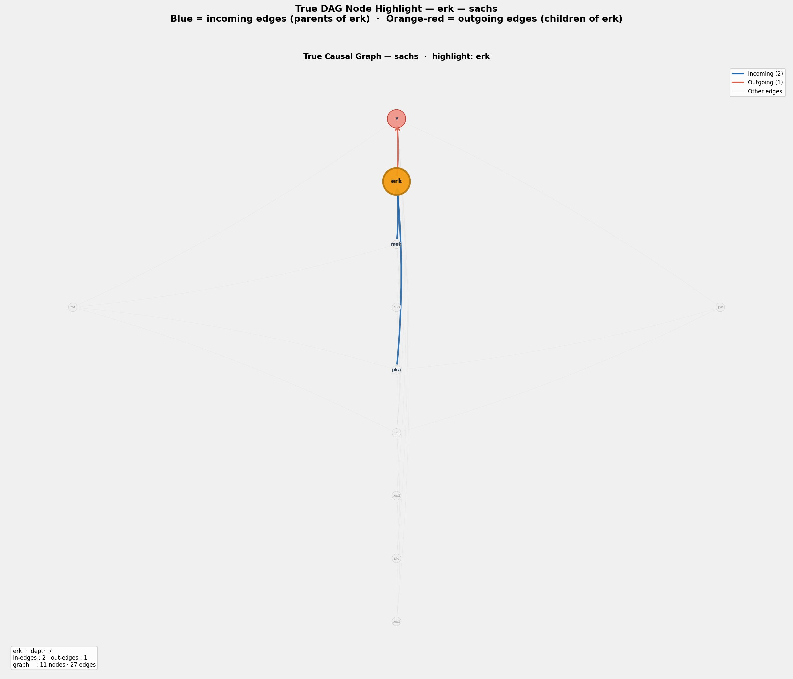

***Figure 4.27: Consensus-DAG neighbourhood of erk, Sachs dataset.*** In the reference structure erk is downstream, receiving incoming edges; its single largest Flow deviation arises precisely when those incoming edges are deleted.

</div>
</div>

# 5. Conclusion

## 5.1 Summary of Findings

This thesis constructed a comprehensive experimental pipeline to systematically evaluate how causal graph estimation errors propagate into structure-aware Shapley feature attributions. The pipeline integrates two causal discovery algorithms (PC and DirectLiNGAM), three structure-aware Shapley methods (Asymmetric Shapley, Causal Shapley, and Shapley Flow), a LightGBM predictive model, and a unified evaluation framework across a controlled synthetic benchmark and the real-world Sachs cell signaling dataset. The empirical findings organize around three central conclusions.

The three methods occupy fundamentally distinct sensitivity regimes. Asymmetric Shapley Values are robust to graph errors: on the 50-feature synthetic dataset, replacing the True DAG with an imprecise discovered graph shifts attribution magnitudes by about 1% of the model-output standard deviation ($\Delta M_{\text{oracle}}$ < 1.1%) and flips fewer than 7% of attribution signs ($D_{\text{oracle}}$ < 6.3%). This robustness is structural: ASV's observational marginalization decouples attribution magnitudes from the specific edge set, and in high-dimensional sparse graphs, most topological orderings are compatible across both the true and discovered graphs. Causal Shapley Values and Shapley Flow are deeply sensitive to graph quality. CSV's interventional conditioning translates every false parent edge into a contaminated post-interventional distribution, and Flow's edge-routing mechanism amplifies graph errors across all downstream paths. On the Sachs dataset, the cross-discovery instability between PC and LiNGAM variants reaches $\Delta M_{\text{disc}}$ = 10.1% of $\hat\sigma$ for CSV and 14.9% for Flow, an order of magnitude above ASV's.

The performance advantage of discovery algorithms reverses between the synthetic and real experimental tracks. PC substantially outperforms LiNGAM on the confounded synthetic data (F1: 0.567 vs. 0.250), where conditional independence testing provides partial protection against latent confounders. On Sachs, LiNGAM outperforms PC (F1: 0.326 vs. 0.167), exploiting non-Gaussian protein concentration distributions. Neither algorithm achieves high absolute accuracy on either dataset, reinforcing that discovered causal graphs should be treated as noisy approximations.

The unified Magnitude Divergence and Sign Disagreement evaluation framework, applied consistently against both the Traditional Shapley baseline and the True DAG oracle, reveals complementary dimensions of attribution shift. ASV deviates minimally from Traditional Shapley while simultaneously aligning closely with the True DAG oracle. CSV and Flow deviate substantially from Traditional Shapley but do not converge to the oracle, suggesting that the large attribution shifts they produce are primarily driven by graph errors rather than genuine causal signal.

## 5.2 Practical Recommendations

Asymmetric Shapley Values are the recommended default when a practitioner wants to incorporate causal structure without incurring attribution instability. In high-dimensional settings with sparse causal graphs, ASV produces attributions nearly indistinguishable from the oracle regardless of which discovery algorithm supplies the graph. The computational cost is identical to standard Monte Carlo SHAP, making ASV a low-risk augmentation.

Causal Shapley Values and Shapley Flow should be deployed only when a high-quality causal graph is available, for example a domain-expert validated graph or a discovery result with strong structural support. On the synthetic confounded dataset, using LiNGAM's erroneous graph with CSV produces $D_{\text{oracle}}$ = 37.5% and a cross-discovery Sign Disagreement $D_{\text{disc}}$ = 37.9% between PC and LiNGAM variants. This level of instability makes it impossible to provide consistent, justifiable explanations across audit runs using different discovery algorithms.

The pipeline developed in this thesis provides a practical benchmark protocol: compute causal discovery quality metrics before running Shapley computation, and if quality is poor, particularly under suspected confounding, default to ASV or the Traditional Shapley baseline. For real datasets where ground truth is unavailable, cross-checking attribution stability across multiple discovery algorithms using $\Delta M_{\text{disc}}$ and $D_{\text{disc}}$ serves as a proxy for reliability: a large cross-discovery divergence between PC and LiNGAM variants is a direct signal that the method's attributions are driven more by graph uncertainty than by the model's predictive behavior.

## 5.3 Limitations and Future Work

Several limitations constrain the generalizability of these findings. The primary analysis was conducted on a single synthetic functional form (linear) and one real dataset. Nonlinear and mixed functional forms, different graph densities, and larger sample sizes remain to be evaluated. The full six-dataset synthetic battery of this pipeline was designed but the complete cross-dataset comparison exceeds the scope of the current work.

All Shapley computations use T = 100 Monte Carlo samples, a deliberate trade-off for the 50-feature system. Increasing T would reduce sampling noise and potentially reveal finer-grained differences. The CausalShapley implementation uses a conditional Gaussian approximation (M = 10 inner samples), appropriate for linear systems but potentially underperforming on nonlinear datasets.

Future work should extend evaluation to nonlinear Shapley variants, explore ensemble graph approaches that average attributions across multiple discovered graphs to reduce instability, and investigate active learning strategies that use Shapley attribution uncertainty to guide iterative graph refinement.

# Appendix A. Shapley Method Subroutines

This appendix collects the helper subroutines invoked by the algorithm blocks of Section 3.4. Each subroutine is grouped under the method or methods that use it. The main algorithm blocks in Section 3.4 call these by name.

## A.1 Coalition Value (Traditional and Asymmetric Shapley)

Both Traditional Shapley (Section 3.4.1) and Asymmetric Shapley (Section 3.4.2) estimate the observational coalition value v(S) = E[f(X) | X_S = x_S] with the same subroutine. Features in the coalition S take the instance's real values; the remaining features are filled in from each background row, and the model output is averaged over the background.

```
COALITION_VALUE(x, S, f, D):              # v(S) = E[f(X) | X_S = x_S]
    samples <- copy(D)                    # one row per background instance
    FOR each feature j in S:
        samples[:, j] <- x[j]             # overwrite column j with the real value
    RETURN mean( f(samples) )             # average prediction over the background
```

## A.2 Uniform Random Topological Ordering (Asymmetric and Causal Shapley)

Asymmetric Shapley (Section 3.4.2) and the outer loop of Causal Shapley (Section 3.4.3) both draw a uniform random linear extension of a DAG with a randomized Kahn algorithm. It maintains a pool of "ready" nodes whose ancestors have all been placed and selects one uniformly at each step, which samples uniformly over the linear extensions and runs in O(n) per ordering. The children lists and initial in-degrees are precomputed once over the relevant DAG (the X-only feature subgraph for Asymmetric, the component DAG for Causal; Y is excluded, as it is never a player). For Asymmetric the procedure operates on features; for Causal it operates on components, whose ordering is then expanded to features.

```
PRECOMPUTE (once):  children[], in_degree[] from the DAG edges (Y excluded)
    # if the feature DAG contains a cycle, disable constraints
    #   -> the method reduces to Traditional Shapley

SAMPLE_TOPOLOGICAL_ORDERING(children, in_degree):
    deg   <- copy(in_degree)
    ready <- [ i : deg[i] == 0 ]          # source nodes
    order <- [ ]
    WHILE ready not empty:
        k    <- uniform_random_index(ready)
        node <- ready[k];  ready[k] <- ready[last];  ready.pop()   # O(1) swap-remove
        order.append(node)
        FOR child in children[node]:
            deg[child] <- deg[child] - 1
            IF deg[child] == 0: ready.append(child)
    RETURN order                          # a uniform linear extension
```

## A.3 Post-Interventional Sampling (Causal Shapley)

The inner loop of Causal Shapley (Section 3.4.3) draws each sample from the post-interventional distribution P(X | do(X_S = x_S)) with the subroutine below. The intervened features are fixed to their instance values, and the remaining features are filled in component by component in a fixed topological order so that parents are resolved before children. Inside a confounded component the missing features are drawn independently given their parents, which destroys the spurious within-component correlation; in an ordinary component they are drawn jointly given the parents and any fixed siblings.

```
POST_INTERVENTIONAL_SAMPLE(x, S, components, confounded[], parents[], mu, Sigma):
    sample <- zeros(n);  FOR j in S: sample[j] <- x[j]   # fix the interventions
    FOR each component C in FIXED topological order:
        missing <- C \ S
        IF missing is empty: CONTINUE
        IF confounded[C]:                                # intervention breaks ties
            FOR j in missing:                            # -> draw INDEPENDENTLY
                sample[j] <- GAUSSIAN_CONDITIONAL(target={j}, cond=parents[C])
        ELSE:                                            # ordinary dependence
            fixed <- C intersect S                       # -> draw JOINTLY, given
            sample[missing] <- GAUSSIAN_CONDITIONAL(      #    parents AND siblings
                target=missing, cond = parents[C] union fixed)
    RETURN sample
```

The conditional draws use the closed-form Gaussian expression under a multivariate-Gaussian approximation of the background data, X ~ N(mu, Sigma). A singular conditioning matrix falls back to the conditional mean, and the univariate branch is used whenever a single feature is sampled (the only case exercised in this thesis, since the confounder list is empty).

```
GAUSSIAN_CONDITIONAL(target A, cond B, vals b):
    IF B is empty:
        RETURN draw from N( mu_A , Sigma_AA )            # marginal
    Sigma_BB_inv <- pseudo_inverse( Sigma_BB )
    mu_cond      <- mu_A + Sigma_AB * Sigma_BB_inv * (b - mu_B)
    Sigma_cond   <- Sigma_AA - Sigma_AB * Sigma_BB_inv * Sigma_BA
    Sigma_cond   <- symmetrise(Sigma_cond); nudge eigenvalues >= epsilon
    RETURN draw from N( mu_cond , Sigma_cond )           # scalar branch if |A| = 1
```

## A.4 System Value (Shapley Flow)

Shapley Flow (Section 3.4.4) evaluates the model on a set of active edges with the subroutine below. Each node is assigned its foreground or background value according to the activation rule, Y is stripped before the model is evaluated, and the empty edge set returns f(x_bg) while the full edge set returns f(x_fg).

```
SYSTEM_VALUE(active_edges, x_fg, x_bg):
    FOR each node i in the graph:
        IF i is a source AND has an active outgoing edge:  val[i] <- x_fg[i]
        ELSE IF i has an active incoming edge:             val[i] <- x_fg[i]
        ELSE IF edge (i -> Y) is active:                   val[i] <- x_fg[i]
        ELSE:                                              val[i] <- x_bg[i]
    drop Y from val                          # Y is never an input to f
    RETURN f(val)
```

# References

Baron, S. (2023). Explainable AI and causal understanding: Counterfactual approaches considered. Minds and Machines, 33, 347-377. https://doi.org/10.1007/s11023-023-09632-w

Frye, C., Rowat, C., & Feige, I. (2021). Asymmetric Shapley values: Incorporating causal knowledge into model-agnostic explainability. Advances in Neural Information Processing Systems, 34, 1229-1239.

Glymour, C., Zhang, K., & Spirtes, P. (2019). Review of causal discovery methods based on graphical models. Frontiers in Genetics, 10, 524. https://doi.org/10.3389/fgene.2019.00524

Heskes, T., Sijben, E., Bucur, I. G., & Claassen, T. (2020). Causal Shapley values: Exploiting causal knowledge to explain individual predictions of complex models. Advances in Neural Information Processing Systems, 33, 4778-4789.

Hoyer, P. O., Shimizu, S., Kerminen, A. J., & Palviainen, M. (2008). Estimation of causal effects using linear non-Gaussian causal models with hidden variables. *International Journal of Approximate Reasoning*, 49(2), 362-378.

Lundberg, S. M., & Lee, S.-I. (2017). A unified approach to interpreting model predictions. Advances in Neural Information Processing Systems, 30, 4765-4774.

Mahajan, D., Tan, C., & Sharma, A. (2020). Preserving causal constraints in counterfactual explanations for machine learning classifiers. Advances in Neural Information Processing Systems, 33.

Pearl, J. (2009). Causality: Models, reasoning, and inference (2nd ed.). Cambridge University Press.

Ramsey, J. D., Hanson, S. J., & Glymour, C. (2014). Multi-subject search correctly identifies causal connections and most causal directions in the fMRI multisubject network challenge. *NeuroImage*, 100, 362-378.

Sachs, K., Perez, O., Pe'er, D., Lauffenburger, D. A., & Nolan, G. P. (2005). Causal protein-signaling networks derived from multiparameter single-cell data. Science, 308(5721), 523-529. https://doi.org/10.1126/science.1105809

Scheines, R. (2024). Example causal datasets: Sachs [Data repository]. Carnegie Mellon University, Department of Philosophy. https://github.com/cmu-phil/example-causal-datasets/tree/main/real/sachs

Shapley, L. S. (1953). A value for n-person games. In H. W. Kuhn & A. W. Tucker (Eds.), Contributions to the Theory of Games (Vol. II, pp. 307-317). Princeton University Press.

Shimizu, S., Hoyer, P. O., Hyvarinen, A., & Kerminen, A. (2006). A linear non-Gaussian acyclic model for causal discovery. Journal of Machine Learning Research, 7, 2003-2030.

Shimizu, S., Inazumi, T., Sogourou, Y., & Hyvarinen, A. (2011). DirectLiNGAM: A direct method for learning a linear non-Gaussian structural equation model. Journal of Machine Learning Research, 12, 1225-1248.

Spirtes, P., Glymour, C., & Scheines, R. (2000). Causation, prediction, and search (2nd ed.). MIT Press.

Wachter, S., Mittelstadt, B., & Russell, C. (2018). Counterfactual explanations without opening the black box: Automated decisions and the GDPR. Harvard Journal of Law & Technology, 31(2), 841-887.

Wang, J., Wiens, J., & Lundberg, S. (2021). Shapley flow: A graph-based approach to interpreting model predictions. Proceedings of the 24th International Conference on Artificial Intelligence and Statistics (AISTATS), PMLR 130.